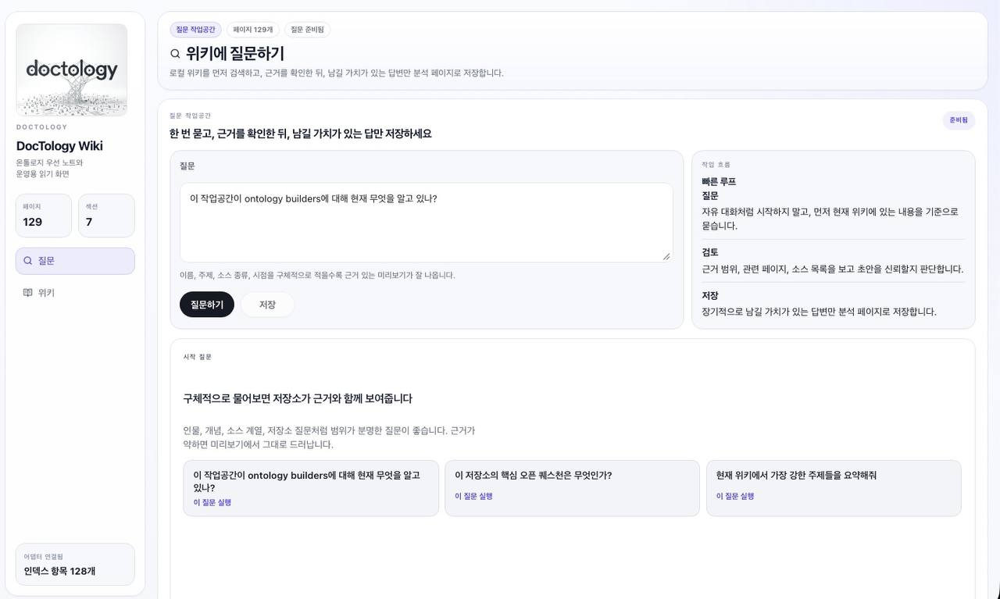

# DocTology

[English](README.md) | [한국어](README.ko.md)

DocTology는 Obsidian-first LLM Wiki와 canonical ontology layer를 결합한 오픈소스 starter kit입니다.

즉, 이런 방향을 원하는 사람을 위한 레포입니다.

- wiki-first 읽기와 synthesis
- JSONL registry 기반의 ontology-backed canonical truth
- 재사용 가능한 skill pack + 실제로 실행 가능한 로컬 reference runtime

이 레포 하나로 DocTology는 다음을 같이 제공합니다.

- bootstrap, ontology, operator 워크플로를 담은 portable `.agent/skills/` 팩
- LLM Wiki CLI와 선택형 workbench UI가 포함된 로컬 reference runtime
- 개인 코퍼스를 공개 레포에 넣지 않고도 private workspace를 시작할 수 있는 깔끔한 baseline



_DocTology 워크벤치 질문 작업공간 — 위키에 질문하고, 근거를 확인한 뒤, 남길 가치가 있는 답만 저장합니다._

## 먼저 어디서 시작하면 되나

목적에 따라 시작점이 다릅니다.

- 재사용 가능한 스킬과 템플릿이 필요하다
  - `.agent/skills/`부터 보세요.
- 지금 이 공개 레포에서 reference runtime을 직접 실행해보고 싶다
  - 아래 `Quick Start`를 따라가면 됩니다.
- 내 데이터로 쓸 깨끗한 새 워크스페이스가 필요하다
  - 아래 `깨끗한 워크스페이스 부트스트랩`으로 가면 됩니다.

## 이 레포에 들어있는 것

```text
DocTology/
├── .agent/
│   └── skills/
│       ├── lightweight-ontology-core/
│       ├── lg-ontology/
│       ├── llm-wiki-bootstrap/
│       ├── llm-wiki-ontology-ingest/
│       ├── ontology-pipeline-operator/
│       └── ...
├── apps/
│   └── workbench/
├── scripts/
├── templates/
├── intelligence/
├── wikiconfig.json
├── wikiconfig.example.json
├── run-workbench.command
├── run_windows_workbench.bat
└── install_windows.bat
```

## Quick Start

이 섹션은 “처음 clone한 사람이 막히지 않고 최소한 한 번은 끝까지 따라갈 수 있게” 쓰는 기준으로 정리했습니다.

### 준비물

필요한 것은 다음입니다.

- Python 3
- Node.js와 npm
- Python용 PyYAML

### 1) 레포 clone

```bash
git clone https://github.com/tteggu87/DocTology.git
cd DocTology
```

### 2) 첫 실행은 안전 모드로 시작

체크인된 `wikiconfig.json`은 로컬 OpenAI-compatible backend를 가정할 수 있습니다.
처음에는 helper-model 호출 없이 repo-local 흐름만 확인하는 편이 안전합니다.
그래서 먼저 example 설정으로 덮어쓰는 것을 권장합니다.

macOS / Linux:

```bash
cp wikiconfig.example.json wikiconfig.json
```

Windows PowerShell:

```powershell
Copy-Item wikiconfig.example.json wikiconfig.json -Force
```

이렇게 하면 helper-model 기능이 비활성화된 상태에서 먼저 기본 런타임을 검증할 수 있습니다.

### 3) 의존성 설치

macOS / Linux:

```bash
python3 -m venv .venv
source .venv/bin/activate
pip install --upgrade pip
pip install pyyaml
npm --prefix apps/workbench ci
```

Windows:

```bat
install_windows.bat
```

### 4) 빈 baseline이 정상 동작하는지 확인

개인 데이터가 하나도 없는 상태에서도 아래 명령은 돌아가야 합니다.

```bash
python3 scripts/llm_wiki.py status
python3 scripts/workbench_api.py --route /api/workbench/summary
```

정상이라면:

- `status`가 에러 없이 0건 상태를 보여주고
- workbench summary route가 JSON을 반환하며
- `missing_index`, `missing_log` 같은 경고는 fresh baseline 기준으로 자연스럽습니다.

### 5) workbench 실행

macOS 원클릭 launcher:

```bash
./run-workbench.command
```

이 스크립트는 다음을 자동으로 합니다.

- Python workbench API를 `127.0.0.1:8765`에서 시작
- Vite frontend를 `127.0.0.1:4174`에서 시작
- 브라우저 자동 열기

Linux 또는 수동 실행 방식:

터미널 1:

```bash
python3 scripts/workbench_api.py --serve --host 127.0.0.1 --port 8765
```

터미널 2:

```bash
npm --prefix apps/workbench run dev -- --host 127.0.0.1 --port 4174
```

브라우저에서 열 주소:

```text
http://127.0.0.1:4174/#home
```

Windows 실행:

```bat
run_windows_workbench.bat
```

## 정상일 때 무엇이 보여야 하나

workbench가 올바른 repo에 붙어 있다면, 홈 화면과 summary API가 다른 로컬 워크스페이스가 아니라 이 저장소를 가리켜야 합니다.

빠른 확인:

```bash
python3 scripts/workbench_api.py --route /api/workbench/summary
```

정상이라면 JSON에 대략 다음이 보여야 합니다.

- `"root": "/.../DocTology"`
- fresh clone 기준 낮거나 0에 가까운 count
- 첫 콘텐츠를 넣기 전 `missing_index`, `missing_log` 같은 경고

## 문제 해결

### launcher가 다른 워크스페이스를 여는 것 같다

이미 다른 workbench가 `4174` 또는 `8765` 포트를 쓰고 있으면, 브라우저 탭이 현재 repo가 아닌 다른 workspace를 보여줄 수 있습니다.

- macOS launcher는 이제 실행 중 listener가 현재 repo 소속인지 확인하고, 다른 repo면 다시 시작합니다.
- 그래도 이상하면 아래로 직접 확인하세요.

```bash
python3 scripts/workbench_api.py --route /api/workbench/summary
```

여기서 `root` 값이 `DocTology`를 가리켜야 합니다.

### `ModuleNotFoundError: No module named 'yaml'`

PyYAML을 설치하면 됩니다.

```bash
pip install pyyaml
```

### frontend가 뜨지 않는다

프론트 의존성을 다시 설치하세요.

```bash
npm --prefix apps/workbench ci
```

### 첫 실행에서 helper-model 호출을 원하지 않는다

example 설정으로 먼저 덮어쓰세요.

```bash
cp wikiconfig.example.json wikiconfig.json
```

이렇게 하면 helper-model 기능이 꺼진 상태에서 repo-local baseline부터 검증할 수 있습니다.

### clone했는데 너무 비어 보인다

정상입니다.
이 공개 레포는 개인 코퍼스를 넣어둔 저장소가 아니라, baseline + reference runtime입니다.
아래 예시처럼 `raw/inbox/`에 테스트 source 하나를 넣고 흐름을 먼저 확인하면 됩니다.

## 첫 콘텐츠 넣어보기

이 레포는 일부러 빈 상태에서 시작합니다.
그래서 가장 빠른 검증은 작은 raw source 하나를 넣고 source page가 생기는지 보는 것입니다.

macOS / Linux:

```bash
mkdir -p raw/inbox
printf 'hello doctology\n' > raw/inbox/hello.txt
python3 scripts/llm_wiki.py ingest raw/inbox/hello.txt --title "Hello Source"
python3 scripts/llm_wiki.py reindex
python3 scripts/llm_wiki.py lint
python3 scripts/llm_wiki.py status
```

Windows PowerShell:

```powershell
New-Item -ItemType Directory -Force raw/inbox | Out-Null
Set-Content raw/inbox/hello.txt 'hello doctology'
python scripts/llm_wiki.py ingest raw/inbox/hello.txt --title "Hello Source"
python scripts/llm_wiki.py reindex
python scripts/llm_wiki.py lint
python scripts/llm_wiki.py status
```

정상이라면 다음 파일들이 생깁니다.

- `wiki/sources/source-<date>-hello-source.md`
- `wiki/_meta/index.md`
- `wiki/_meta/log.md`

이 단계까지 되면 최소한 다음이 모두 연결된 것입니다.

- CLI
- template 경로
- wiki 메타 갱신 흐름
- 기본 reference runtime

## 깨끗한 워크스페이스 부트스트랩

레포 루트를 바로 쓰는 대신, 내 데이터용 workspace를 따로 만들고 싶다면 번들된 bootstrap 스크립트를 쓰면 됩니다.

### plain wiki 워크스페이스

```bash
python3 .agent/skills/llm-wiki-bootstrap/scripts/bootstrap_llm_wiki.py ~/Documents/my-llm-wiki --profile wiki-only
```

### wiki + ontology 스타터

```bash
python3 .agent/skills/llm-wiki-bootstrap/scripts/bootstrap_llm_wiki.py ~/Documents/my-llm-wiki --profile wiki-plus-ontology
```

이 경로는 다음에 적합합니다.

- 내 전용 `raw/`, `wiki/`, `warehouse/`를 따로 두고 싶을 때
- 실제 데이터가 들어가는 로컬 워크스페이스가 필요할 때
- 공개 레포 자체를 개인 vault로 쓰고 싶지 않을 때

## 포함된 대표 skill 계열

대표적으로 아래 계열이 같이 들어 있습니다.

- `llm-wiki-bootstrap`
  - 새 Obsidian-first LLM Wiki 워크스페이스 생성
- `llm-wiki-ontology-ingest`
  - 기존 ontology-backed wiki에 source ingest
- `lightweight-ontology-core`
  - canonical JSONL ontology truth 관리
- `lg-ontology`
  - canonical truth 위에 파생 graph-style inspection 추가
- `ontology-pipeline-operator`
  - 기존 ontology/wiki 파이프라인 운영과 refresh

## 이 레포를 이해하는 가장 좋은 방식

이 레포는 두 방식 중 하나로 쓰면 됩니다.

1. 공개용 skill-pack + reference implementation
2. 내 워크스페이스를 만들기 위한 bootstrap source

즉 공개 기준선과 개인 실데이터 저장소를 혼동하지 않는 것이 가장 중요합니다.

## 메모

- 이 레포에서 portable 폴더명 기준은 `.agent`입니다.
- 첫 로컬 테스트에는 `wikiconfig.example.json` 쪽이 더 안전한 기본값입니다.
- `intelligence/`는 실제 런타임 일부가 직접 읽기 때문에 의도적으로 포함되어 있습니다.
- workbench는 선택형이지만, CLI와 runtime contract는 placeholder가 아닙니다.
