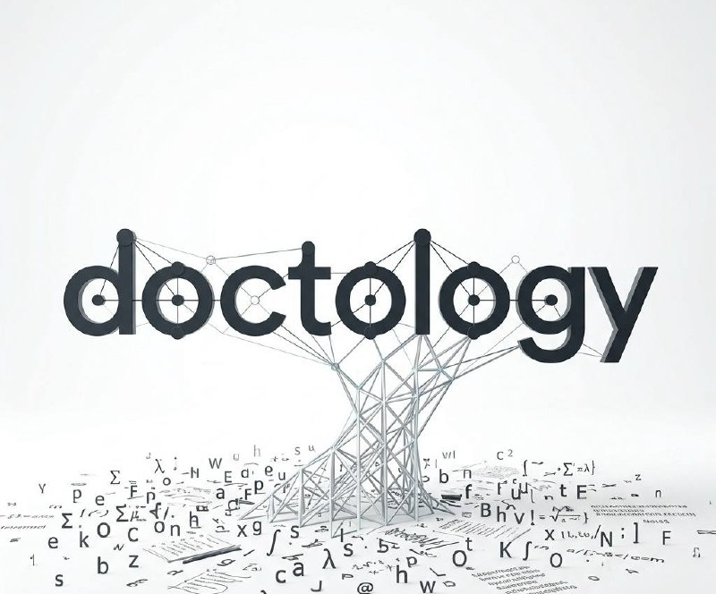

  

# DocTology

[English](README.md) | [한국어](README.ko.md)

DocTology는 **사람과 에이전트를 위한 wiki-first knowledge operating system** 입니다.

이 프로젝트는 다음이 가능한 저장소를 만들게 해줍니다.

- 사람은 읽고 고칠 수 있는 durable wiki를 유지하고
- 에이전트는 canonical JSONL truth를 바탕으로 claim과 provenance를 검증하며
- graph/operator workflow는 필요할 때만 붙는 support layer로 유지합니다

핵심 아이디어는 단순합니다.

- 먼저 사람이 실제로 읽을 수 있는 Obsidian-first wiki를 세웁니다
- provenance, contradiction, review state가 필요해질 때 canonical ontology truth를 붙입니다
- graph나 operator workflow는 깊은 구조나 반복 운영이 정말 필요할 때만 확장합니다

이 레포 하나로 DocTology는 다음을 제공합니다.

- bootstrap, ontology, operator 워크플로를 담은 portable skill pack
- LLM Wiki CLI와 선택형 workbench UI가 포함된 로컬 reference runtime
- 개인 코퍼스를 공개 레포에 넣지 않고도 private workspace를 시작할 수 있는 baseline

## 이것이 무엇인가

DocTology는 단순한 노트 저장소도 아니고, ontology toolkit만도 아니며, graph 실험 레포만도 아닙니다.

이 프로젝트는 다음 구조를 가진 지식 시스템을 만들기 위한 프레임입니다.

- **wiki** = 사람이 읽는 front surface
- **canonical JSONL** = 기계가 검증하는 provenance / truth / review surface
- **graph/operator layer** = 필요할 때만 붙는 optional extension

## 누가 써야 하나

다음이 필요하면 DocTology가 맞습니다.

- vector index나 raw context dump가 아니라 실제로 읽을 수 있는 knowledge base
- plain notes보다 강한 provenance
- personal wiki -> ontology-backed verification -> optional graph/operator workflow로 점진적으로 자라는 구조

즉 이 레포는 **사람에게는 읽기 쉬우면서, 에이전트에게는 신뢰 가능한 지식 시스템**을 원하는 사용자에게 가장 잘 맞습니다.

_DocTology 워크벤치 질문 작업공간 — 현재 위키를 확인하고, repo-local 질문 미리보기를 검토하며, bounded analysis page만 저장합니다._

현재 workbench의 실제 성격은 자유 대화형 LLM 작업공간이라기보다, 생성된 위키와 관련 preview를 읽고 검토하는 화면에 가깝습니다. 즉, 아직 능동적인 conversational chat 면은 아닙니다.

_참고 예시 — 서로 거의 연결되지 않았던 Obsidian 노트들이 점차 구조와 neighborhood를 형성하며 위키처럼 자라나는 모습을 보여줍니다._

## 기본 시작 경로

어디서 시작해야 할지 애매하다면 기본 경로는 이렇습니다.

1. wiki-first workspace를 bootstrap
2. source를 wiki + canonical ontology로 ingest
3. complexity가 커질 때만 route receipts와 operator workflow를 붙임

즉 DocTology의 기본 약속은:

- 먼저 readable wiki
- 그다음 verifiable truth
- 마지막에만 graph/operator complexity

## 내가 지금 어느 경로에 있나?

빠른 기준은 이렇습니다.

- **시작점:** `llm-wiki-bootstrap`
- **일상 경로:** `llm-wiki-ontology-ingest`
- **고급 canonical engine:** `lightweight-ontology-core`
- **선택적 graph 확장:** `lg-ontology`

대부분의 사용자는 다음 순서로 시작하면 됩니다.

1. 프로젝트 로컬 `llm-wiki-bootstrap`
2. 반복적인 `llm-wiki-ontology-ingest`

즉 나머지 ontology 스킬들은 기본 시작점이 아니라, 나중 단계의 정제/확장 레이어로 이해하는 것이 맞습니다.

입니다.

## 어디서 시작할지 먼저 고르세요

### 1) LLM Wiki를 먼저 쓰고 싶나요?
그렇다면 `llm-wiki-bootstrap`으로 시작하면 됩니다.

흐름은 단순합니다.

- 위키 부트스트랩 실행
- 생성된 `raw/inbox/` 폴더에 문서를 넣기
- `llm-wiki-ontology-ingest`로 ingest 진행
- 이후 질문·분석 워크플로로 위키를 계속 키우기

현재 ontology 프로필 bootstrap은 더 오래 가는 repo를 위해 다음 로컬 rebuild helper와 state 경로도 함께 만듭니다.

- `state/wiki_index.sqlite`
- `state/wiki_analytics.duckdb`
- `scripts/reindex_sqlite_operational.py`
- `scripts/refresh_duckdb_analytics.py`
- `scripts/verify_three_layer_drift.py`

이 bootstrap 계층의 DuckDB는 로컬 wiki analytics mirror 입니다.
즉 ontology-core / lg 쪽의 ontology mirror contract와는 분리된 의미입니다.
의도된 범위는 source registry, page coverage, audit 성격의 가벼운 wiki-facing analytics 입니다.

즉, 시작점은 항상 **wiki-first** 입니다.

### 2) 생성된 위키에서 ontology 관계를 더 다듬고 싶나요?
그렇다면 `lightweight-ontology-core`를 사용하세요.

이 단계에서는:

- 엔티티 / claim / evidence / relation 같은 canonical ontology layer를 정리하고
- 위키 아래의 JSONL truth를 더 정교하게 만들며
- 필요하면 이후 `lg-ontology`로 graph / neighborhood 확장까지 이어갈 수 있습니다.

즉, 위키를 만든 뒤 관계를 재정의하고 구조를 더 강하게 만들고 싶을 때 들어가는 단계입니다.

### 3) 프로젝트 전용 기억창고를 만들고 싶나요?
그렇다면 `repo-docs-intelligence-bootstrap`을 사용하세요.

이 경로는 개인 위키를 키우는 쪽보다:

- 특정 코드베이스나 프로젝트의 현재 상태를 기억시키고
- 에이전트가 읽을 project memory를 만들고
- repo-docs intelligence 스타일의 AGENTS / intelligence contract를 세우는 데 더 맞습니다.

즉, 이것은 **위키 부트스트랩의 대체 선택지**이지, 그 위에 겹쳐서 또 실행하는 단계가 아닙니다.

## 주의

**부트스트랩은 하나만 사용하세요.**

여러 부트스트랩을 연속으로 실행하면 `AGENTS.md`가 덮어쓰기되어 이전 설정과 운영 규칙이 무효가 될 수 있습니다.

처음에 먼저 선택해야 합니다.

- LLM Wiki를 키우고 싶은가?
- 아니면 repo용 intelligence / project memory를 만들고 싶은가?

둘 다 중요하지만, 시작 부트스트랩은 하나만 고르는 것이 맞습니다.

## 핵심 skill 경로

- `llm-wiki-bootstrap`
  - Obsidian-first LLM Wiki 시작
- `llm-wiki-ontology-ingest`
  - inbox 문서를 ontology-backed wiki로 ingest
- `lightweight-ontology-core`
  - 위키 아래의 canonical ontology truth 정리
- `lg-ontology`
  - ontology graph / neighborhood 확장
- `repo-docs-intelligence-bootstrap`
  - 프로젝트 전용 기억창고 / repo intelligence bootstrap

## Three-layer 운영 모델

더 오래 가는 wiki 시스템으로 키울 때 권장하는 계층은 다음과 같습니다.

1. **파일을 canonical truth로 유지**
   - markdown / yaml / jsonl이 durable truth surface
2. **SQLite를 운영 인덱스로 사용**
   - backlink, unresolved link, alias, memory, job 관리
3. **DuckDB를 분석 창고로 사용**
   - claims, entities, relations, coverage snapshot, audit 중심 분석

권장 도입 순서는:

- v0: file-first wiki
- v1: SQLite 운영 인덱스
- v2: DuckDB 분석 창고

이렇게 해야 wiki는 사람에게 읽히고, 에이전트에게는 신뢰 가능하며, 파생 계층이 깨져도 재생성이 가능합니다.

## 지금 체크인된 reference runtime에 대해

이 저장소에 포함된 workbench는 현재 자유 대화형 LLM 앱이라기보다:

- 생성된 위키를 확인하고
- repo-local preview를 검토하고
- bounded analysis page를 저장하는

읽기·검토용 reference surface에 가깝습니다.

즉, README의 핵심은 런타임 사용법보다 **어떤 부트스트랩을 고르고 어떤 기억 계층을 만들지**를 이해하는 데 있습니다.
