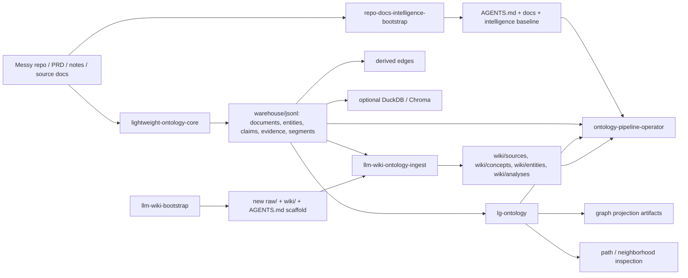

<p align="center">
  
</p>

# DocTology

Turn messy repositories, PRDs, notes, and research documents into a maintainable knowledge stack.

DocTology is a practical skill pack for teams who want to:
- make current repository truth explicit
- reduce drift between code and docs
- turn documents into claim/evidence-based ontology artifacts
- add graph-style inspection only when it is actually useful
- optionally run the same flow inside an Obsidian-first LLM Wiki

Instead of forcing a full graph platform from day one, DocTology gives you a staged path:

`repo cleanup and truth alignment -> canonical ontology -> optional graph projection -> optional operator workflow`

## Why DocTology

Most repositories and document piles eventually look like this:
- the code changed, but README and operating docs still describe an older reality
- wrappers, scripts, CLIs, notebooks, and experiments all coexist without a clear canonical path
- meeting notes and design memos accumulate, but nobody knows which claims are still valid
- every new human or agent session has to rediscover context from scratch

DocTology treats this as a knowledge-operations problem, not a writing problem.

It helps you create a repo where:
- `AGENTS.md` tells future agents how to work
- `docs/` reflects the live codebase and current architecture
- `intelligence/` captures lightweight contracts, vocabularies, and policies
- `warehouse/jsonl/` stores canonical machine-readable facts
- `wiki/` can become the human-facing synthesis layer when needed

## What is in this repository

DocTology is not one monolithic framework.
It is a collection of skills you can combine depending on the maturity of your project.

| Skill | Best for | What it produces |
|---|---|---|
| `repo-docs-intelligence-bootstrap` | messy repos, PRDs, current-state refresh | `AGENTS.md`, `docs/`, `intelligence/` baseline |
| `lightweight-ontology-core` | claim/evidence extraction from docs and notes | canonical JSONL ontology, segments, derived edges |
| `lg-ontology` | graph-style neighborhood and path inspection | graph projection artifacts on top of the ontology |
| `llm-wiki-bootstrap` | new Obsidian-first LLM Wiki repo | `raw/`, `wiki/`, `AGENTS.md`, starter scripts and meta pages |
| `llm-wiki-ontology-ingest` | ingesting new sources into an existing wiki repo | synchronized `warehouse/jsonl/` + `wiki/` updates |
| `ontology-pipeline-operator` | operating an already-structured DocTology repo | refresh, regression checks, docs sync, single-entry maintenance |

## Start here: choose by use case

### 1) “My repository is confusing. I need structure first.”
Use:
`repo-docs-intelligence-bootstrap`

Choose this when you want to:
- identify the real entrypoints
- separate current vs legacy docs
- generate or refresh `AGENTS.md`
- add a lightweight `intelligence/` contract layer
- make future agent sessions start faster

Prompt example:

```text
Apply repo-docs-intelligence-bootstrap to this repository.
Use the live codebase to refresh AGENTS.md, current-state docs, and a minimal intelligence layer.
Do not delete old docs blindly; classify them into current vs archive.
```

### 2) “I need evidence-backed knowledge, not just nicer docs.”
Use:
`lightweight-ontology-core`

Choose this when you want to:
- extract entities, claims, evidence, and segments from documents
- track contradictions, supersession, and accepted-vs-proposed states
- prepare retrieval without confusing retrieval with source-of-truth
- create canonical knowledge registries for later reasoning

Prompt example:

```text
Apply lightweight-ontology-core to this repository's docs and notes.
Extract entities, claims, evidence, and segments.
Only derive downstream edges from accepted claims.
Treat retrieval as a helper layer, not canonical truth.
```

### 3) “I want graph-style inspection, but I do not want to rebuild everything around a graph DB.”
Use:
`lg-ontology`

Choose this when you want to:
- inspect multi-hop paths
- explore neighborhoods around entities, claims, and documents
- compare direct JSONL reasoning vs graph-assisted exploration
- export graph projection artifacts without promoting them to source-of-truth

Prompt example:

```text
Apply lg-ontology on top of the existing lightweight ontology.
Keep JSONL registries canonical, but add graph projection artifacts and baseline-vs-graph comparison checks.
```

### 4) “I want a fresh Obsidian-first LLM Wiki repo.”
Use:
`llm-wiki-bootstrap`

Choose this when you want to:
- create a new markdown-first wiki workspace
- bootstrap `raw/`, `wiki/`, `AGENTS.md`, starter scripts, and meta pages
- optionally start with ontology-ready folders too

Prompt example:

```text
Use llm-wiki-bootstrap to scaffold a new Obsidian-first wiki repo.
Use the wiki-plus-ontology profile so the project starts with raw, wiki, AGENTS.md, warehouse/jsonl, and minimal intelligence manifests.
```

### 5) “I already have a wiki repo and want repeated ingest.”
Use:
`llm-wiki-ontology-ingest`

Choose this when you already have:
- `raw/`
- `wiki/`
- repo-local `AGENTS.md`
- ideally `warehouse/jsonl/` and `intelligence/`

This skill is the user-facing button for:
`raw source -> canonical ontology -> wiki synthesis -> meta refresh`

Prompt example:

```text
Use llm-wiki-ontology-ingest to process the new sources in raw/inbox.
Refresh warehouse/jsonl, affected wiki pages, and wiki/_meta/index.md plus wiki/_meta/log.md.
```

### 6) “The stack already exists. I just need it to keep running cleanly.”
Use:
`ontology-pipeline-operator`

Choose this when you want to:
- refresh ontology outputs after source changes
- rebuild reports and graph projection artifacts
- check regressions in graph-assisted workflows
- wire a single operator entrypoint for routine maintenance
- keep current-state docs and wiki maintenance paths synchronized

Prompt example:

```text
Use ontology-pipeline-operator to refresh this repository.
Rebuild canonical outputs, validate graph regression risks, and sync current-state docs and wiki maintenance paths.
```

## Recommended paths

### Path A. Repository truth alignment first
Best for most software projects.

`repo-docs-intelligence-bootstrap -> lightweight-ontology-core -> lg-ontology (optional) -> ontology-pipeline-operator (optional)`

Use this when you start from a codebase or PRD and want to grow toward structured knowledge gradually.

### Path B. Obsidian-first knowledge repo first
Best for research, notes, memos, chat logs, and durable markdown synthesis.

`llm-wiki-bootstrap -> llm-wiki-ontology-ingest -> lg-ontology (optional) -> ontology-pipeline-operator (optional)`

Use this when the human-facing wiki is the primary interface and canonical ontology lives underneath it.

### Path C. Fast ontology only
Best when the structure is already good enough.

`lightweight-ontology-core`

Use this when you do not need repo-wide cleanup and only want claim/evidence-based extraction.

## Mental model

Think of the stack in layers:

1. `repo-docs-intelligence-bootstrap`
   - operational alignment layer
   - clarifies what is official, current, and legacy

2. `lightweight-ontology-core`
   - canonical fact and provenance layer
   - stores entities, claims, evidence, and segments as machine-readable truth

3. `lg-ontology`
   - graph exploration layer
   - helps with paths, neighborhoods, and graph-style inspection

4. `llm-wiki-*`
   - human-facing wiki workflow layer
   - lets the same ontology-backed truth feed an Obsidian-style markdown knowledge surface

5. `ontology-pipeline-operator`
   - maintenance and operations layer
   - keeps repeated refresh workflows coherent over time

## Architecture at a glance



## What makes this different

DocTology is opinionated about boundaries.

- docs are not the same as canonical facts
- retrieval is not the same as source-of-truth
- graph projection is not the same as canonical ontology
- wiki synthesis is not the same as raw source material
- operator scripts should coordinate layers, not silently replace them

This separation keeps the system understandable as it grows.

## Who this is for

DocTology is especially useful for:
- AI and ML repositories with many experiments and shifting docs
- long-running personal or team knowledge repos
- PRD-heavy or memo-heavy product work
- repositories where agent sessions restart often and context continuity matters
- systems that may later grow into provenance-aware retrieval or graph-assisted inspection

## What DocTology is not

DocTology is not:
- a full RDF/OWL platform
- a graph database starter kit
- a background daemon that auto-syncs everything forever
- a one-click replacement for judgment about what is true, current, or accepted

It is a practical staged workflow for making repository and document truth explicit.

## Repository contents

- [repo-docs-intelligence-bootstrap](./repo-docs-intelligence-bootstrap)
- [lightweight-ontology-core](./lightweight-ontology-core)
- [lg-ontology](./lg-ontology)
- [llm-wiki-bootstrap](./llm-wiki-bootstrap)
- [llm-wiki-ontology-ingest](./llm-wiki-ontology-ingest)
- [ontology-pipeline-operator](./ontology-pipeline-operator)

## Quick decision guide

If you are unsure, use this:

- need repository structure and current-state docs first -> `repo-docs-intelligence-bootstrap`
- need claim/evidence ontology from documents -> `lightweight-ontology-core`
- need graph-style exploration on top of ontology -> `lg-ontology`
- need a new Obsidian-first wiki repo -> `llm-wiki-bootstrap`
- need repeated ingest into an existing wiki repo -> `llm-wiki-ontology-ingest`
- need repeatable refresh and operator maintenance -> `ontology-pipeline-operator`

## English summary

DocTology is a staged skill pack for turning messy repositories and document corpora into a maintainable knowledge stack.
Start with repository truth alignment, add canonical ontology only when needed, add graph projection only when it earns its keep, and use the LLM Wiki path when you want a human-facing markdown knowledge surface.
