<p align="center">
  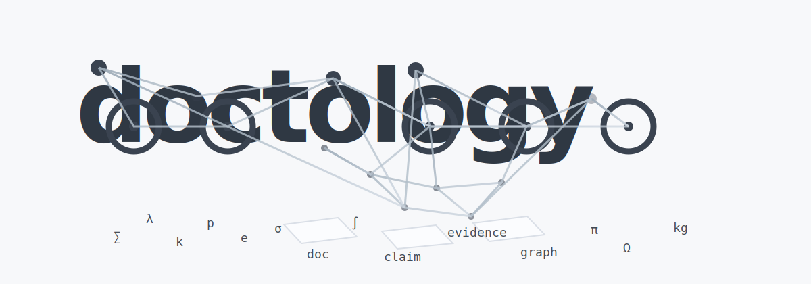
</p>

# DocTology

Repo Bootstrap + Lightweight Ontology Skills

## 한국어

> **기존 프로젝트와 문서를 먼저 정리하고, 필요할 때만 경량 온톨로지와 그래프 분석을 얹는 3-skill starter pack**
> 이 레포는 `repo bootstrap -> canonical ontology -> optional graph projection` 흐름을 가볍게 시작하게 해줍니다.

> TL;DR
> 이 레포는 `풀 온톨로지 플랫폼`이나 `graph DB starter`가 아닙니다.
> 대신 아래 같은 상황에서 바로 쓰기 좋은 실무형 starter pack입니다.

**언제 쓰는가**
- 프로젝트 시작 시, 레포나 PRD를 구조화하고 current truth를 정리하고 싶을 때
- 문서를 온톨로지화해서 분석하고 싶을 때
- 예: 회의록, 메일, 교육자료, 금융 메모, 투자 노트, 주식 분석 자료

**세 스킬의 역할**

- `repo-docs-intelligence-bootstrap`
  - 프로젝트, 레포, PRD를 구조화하고 `AGENTS.md`, `docs/`, `intelligence/` 기준선을 만듭니다.
- `lightweight-ontology-core`
  - 문서와 노트를 canonical ontology로 바꿉니다.
- `lg-ontology`
  - ontology 위에 graph projection과 graph-style inspection을 추가합니다.

이 레포의 기본값은 `repo-docs`부터 시작하는 것입니다.
필요할 때만 `core`, 그 다음 `lg`를 단계적으로 얹는 흐름을 권장합니다.

## 빠른 선택

- `repo-docs` 단독
  - 기존 프로젝트, 문서 폴더, 또는 PRD가 있고 먼저 구조화, current truth 정리, AGENTS/docs/intelligence 기준선 정리가 필요할 때
- `repo-docs -> lightweight-ontology-core`
  - 구조를 먼저 정리한 뒤 canonical ontology만 만들고 싶을 때
- `repo-docs -> lg-ontology`
  - 구조를 먼저 정리한 뒤 ontology와 graph projection까지 같이 보고 싶을 때
- `lightweight-ontology-core` 단독
  - 이미 폴더 구조가 괜찮고, 빠르게 문서/노트를 claim-evidence ontology로 바꾸고 싶을 때
- `lg-ontology` 단독
  - 이미 ontology 감각이 있거나, graph-style inspection과 비교 실험까지 한 번에 보고 싶을 때

기본 추천은 이렇습니다.

- 프로젝트나 PRD를 먼저 정리: `repo-docs`
- 일반적인 온톨로지화: `repo-docs -> lightweight-ontology-core`
- 그래프형 온톨로지화: `repo-docs -> lg-ontology`

## 자주 쓰는 명령 시나리오

### 1. repo 단독으로 구조화

```text
repo-docs로 [<대상 프로젝트 또는 PRD 폴더>](<경로>) 구조화해줘.
```

### 2. 구조화 후 기본 온톨로지화

```text
repo-docs로 구조화 먼저하고 lightweight-ontology-core로 온톨로지화해줘.
```

### 3. 구조화 후 그래프형 온톨로지화

```text
repo-docs로 구조화 먼저하고 lg-ontology로 온톨로지 그래프화 해줘.
```

### 4. core 단독 빠른 온톨로지화

```text
lightweight-ontology-core로 [<대상파일또는폴더>](<경로>) 온톨로지화해줘.
```

### 5. lg 단독 빠른 그래프형 온톨로지화

```text
lg-ontology로 [<대상파일또는폴더>](<경로>) 온톨로지 그래프화 해줘.
```

## 실험에서 확인한 점

- `repo-docs`는 온톨로지 전처리용만이 아니라, 프로젝트/레포/PRD를 현재 기준으로 정리하는 본래 목적만으로도 충분히 가치가 있습니다.
- `lightweight-ontology-core`는 canonical truth와 provenance 정리에 강합니다.
- `lg-ontology`는 정답을 마법처럼 더 똑똑하게 만들기보다, multi-hop path, neighborhood, graph-style inspection 질문에서 강합니다.
- 단순 집계나 직접 추출 질문은 `core`만으로 충분한 경우가 많고, 사람-주제-근거 연결이나 경로 설명은 `lg`가 더 잘 맞습니다.

## 이 레포가 해결하려는 문제

기존 프로젝트는 보통 이런 상태로 커집니다.

- 실제 코드는 바뀌었는데 `README`와 운영 문서는 예전 상태를 설명함
- 스크립트, CLI, 래퍼, 실험 폴더가 섞여서 공식 진입점이 모호함
- 사람마다 다른 설명을 하고, 새 세션의 에이전트도 매번 다시 맥락을 추론해야 함
- 기능은 되지만 문서와 규칙이 코드 뒤를 따라오지 못해 드리프트가 생김

이 두 스킬은 이 문제를 "문서를 예쁘게 쓰는 것"이 아니라 "현재 truth를 명시적으로 남기는 것"으로 다룹니다.

## 핵심 개념

### 1. Bootstrap은 저장소의 기준선을 만든다

`repo-docs-intelligence-bootstrap`는 보통 아래 결과물을 지향합니다.

- 루트 `AGENTS.md`
- `docs/README.md`
- `docs/CURRENT_STATE.md`
- `docs/ARCHITECTURE.md`
- `docs/LAYERS.md`
- `docs/SKILLS_INTEGRATION.md`
- `docs/ROADMAP.md`
- `docs/IMPACT_SUMMARY.md`
- `docs/archive/`
- `intelligence/glossary.yaml`
- `intelligence/manifests/actions.yaml`
- `intelligence/manifests/entities.yaml`
- `intelligence/manifests/datasets.yaml`
- `intelligence/handlers/*.yaml`
- `intelligence/policies/*.yaml`
- `intelligence/schemas/*.sql`
- `intelligence/registry/capabilities.yaml`

이 구조의 목적은 "이 프로젝트는 지금 무엇이 공식이고, 무엇이 레거시이며, 어디가 source of truth인지"를 빠르게 보이게 만드는 것입니다.

### 2. Ontology는 문서를 지식 레이어로 바꾼다

`lightweight-ontology-core`는 아래처럼 더 구조화된 운영이 필요할 때 들어갑니다.

- 문서에서 엔터티를 뽑고 싶을 때
- 결정 사항을 claim과 evidence로 연결하고 싶을 때
- 예전 문서와 새 문서가 충돌하는지 추적하고 싶을 때
- 문서 내용을 segment 단위로 나눠 retrieval이나 provenance에 쓰고 싶을 때
- "무엇이 accepted 사실인가"를 데이터로 관리하고 싶을 때

주요 산출물은 보통 아래와 같습니다.

- `intelligence/manifests/relations.yaml`
- `intelligence/manifests/document_types.yaml`
- `warehouse/jsonl/entities.jsonl`
- `warehouse/jsonl/documents.jsonl`
- `warehouse/jsonl/claims.jsonl`
- `warehouse/jsonl/claim_evidence.jsonl`
- `warehouse/jsonl/segments.jsonl`
- `warehouse/jsonl/derived_edges.jsonl`
- `warehouse/ontology.duckdb`
- `vector/chroma/`

## 시각화

### 두 스킬의 역할 분담

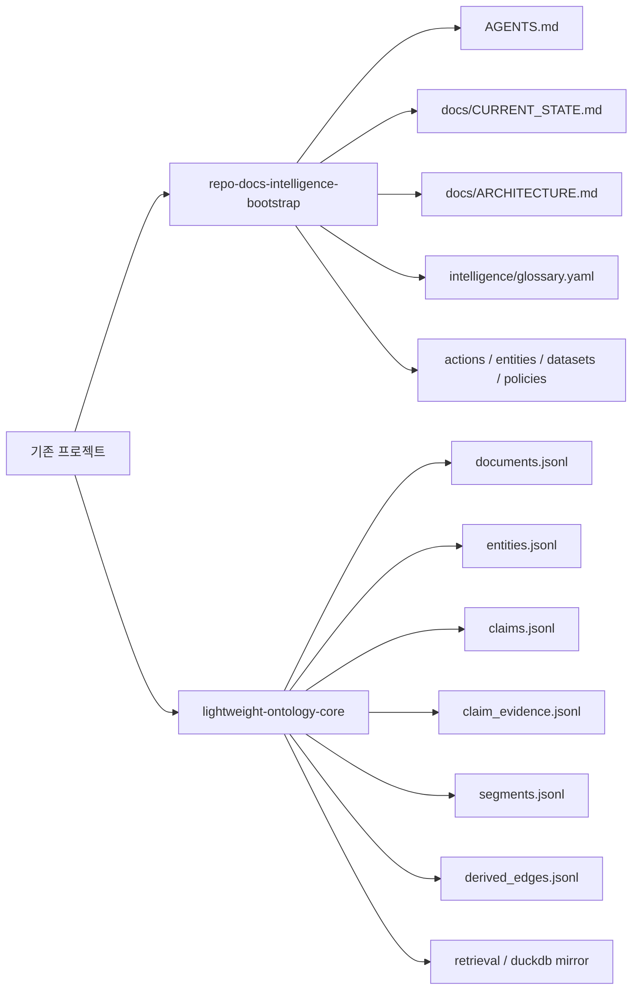

읽는 법은 단순합니다.

- `bootstrap`는 레포의 운영 기준선과 현재 상태 문서를 만듭니다.
- `ontology`는 문서 내용을 구조화된 사실 레이어로 바꿉니다.
- 둘이 겹치는 것처럼 보여도, 실제로는 `운영 정렬`과 `지식 구조화`로 책임이 나뉩니다.

### 실제로 굴러가는 구조

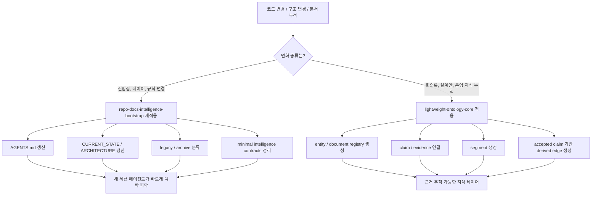

핵심은 `항상 둘 다 돌리는 구조`가 아니라, 변화의 성격에 따라 필요한 스킬을 다시 적용하는 구조입니다.

### bootstrap의 의도

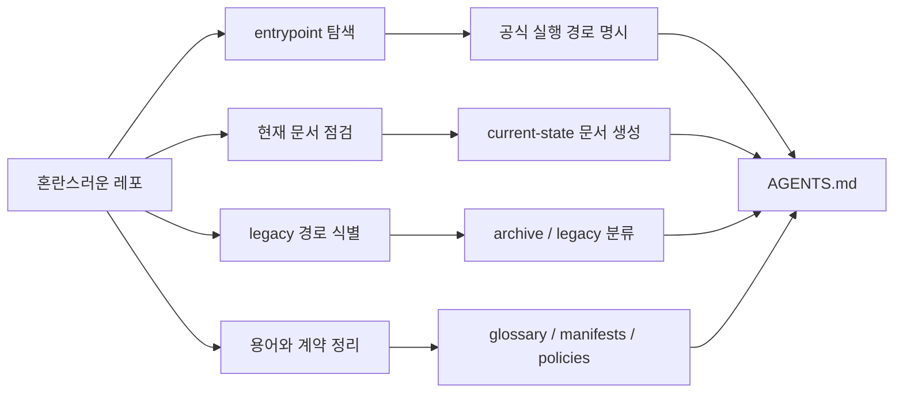

이 스킬의 의도는 문서를 많이 만드는 것이 아닙니다.

- 에이전트가 헤매지 않게 시작점을 짧게 만들기
- "무엇이 공식인가"를 레포 안에 명시적으로 남기기
- 오래된 문서를 삭제하지 않고 의미 있게 분류하기
- 코드와 문서가 어긋나는 드리프트를 구조적으로 줄이기

### 경량 온톨로지의 의도

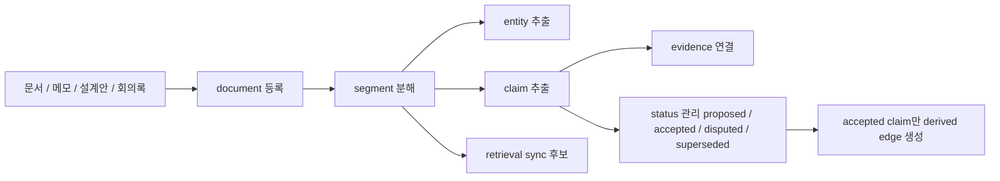

이 스킬의 의도는 "문서를 더 예쁘게 정리"가 아닙니다. 더 정확히는 아래입니다.

- 텍스트를 `사람이 읽는 설명`에서 `기계도 다룰 수 있는 사실 구조`로 바꾸기
- claim이 어디서 왔는지 evidence로 추적 가능하게 만들기
- accepted / disputed / superseded 상태를 분리해서 운영하기
- retrieval을 붙여도 canonical truth와 헷갈리지 않게 분리하기

### 경량 온톨로지 내부 레이어

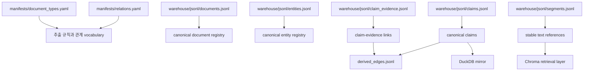

이 구조에서 중요한 구분은 아래입니다.

- `JSONL registry`는 canonical
- `derived_edges`는 accepted claim 기반의 derived output
- `DuckDB`는 분석용 mirror
- `Chroma`는 retrieval 보조층

즉 `검색 결과`가 곧 `승인된 사실`이 되지 않도록 경계를 분명히 둡니다.

### 에이전트가 왜 더 "알잘딱" 움직이게 되는가

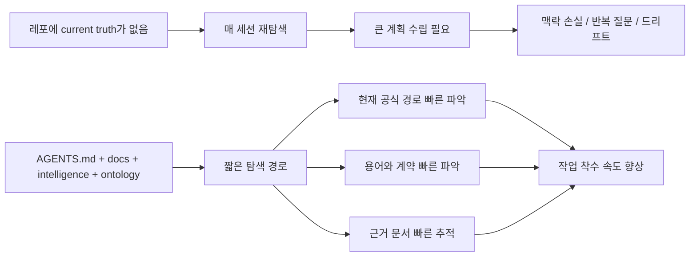

여기서 중요한 포인트는 자동 판단의 근거가 "모델 감"이 아니라 "레포 안에 저장된 구조화된 truth"라는 점입니다.

### bootstrap만 쓸 때와 ontology까지 쓸 때의 차이

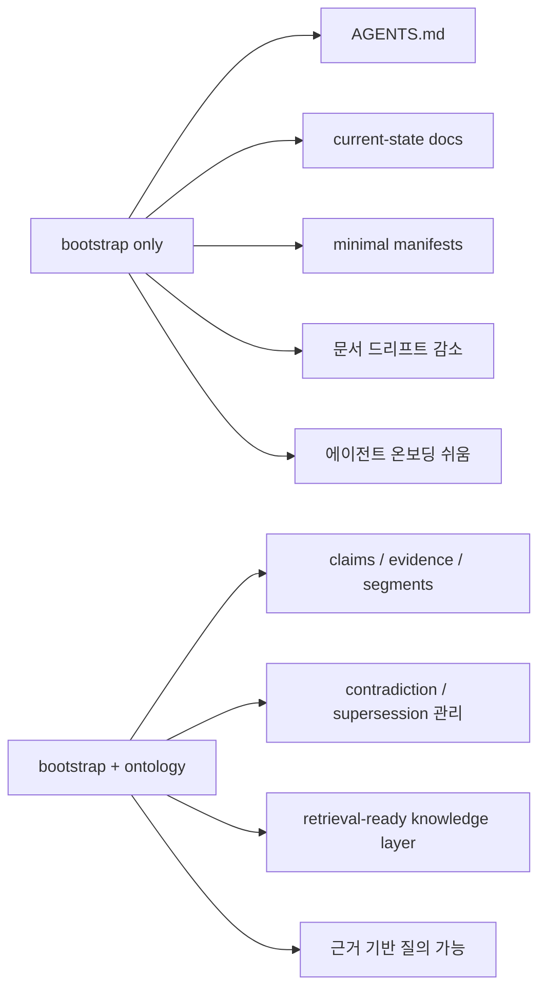

실무 판단 기준은 보통 이렇습니다.

- 현재 필요한 것이 `정리와 기준선`이면 `bootstrap`
- 현재 필요한 것이 `사실/근거 추적`이면 `ontology`
- 둘 다 필요하면 `bootstrap` 후 `ontology`

## 기존 프로젝트에 적용하는 가장 실무적인 순서

아래 순서가 가장 안정적입니다.

### 1. 먼저 bootstrap만 적용한다

기존 프로젝트 루트에서 Codex에게 아래처럼 요청합니다.

```text
이 레포에 repo-docs-intelligence-bootstrap를 적용해서
현재 코드 기준으로 AGENTS.md, docs, intelligence 최소 구조를 정리해줘.
기존 문서는 삭제하지 말고 current / archive 기준으로 분류해줘.
```

이 단계에서 기대하는 일은 다음과 같습니다.

- 실제 엔트리포인트 탐색
- 공식 CLI와 비공식 래퍼 구분
- 현재 코드와 안 맞는 문서 표시
- 필요한 문서는 갱신
- 오래된 문서는 `docs/archive/`로 분류
- 루트 `AGENTS.md`에 작업 규칙 정리
- 최소 `intelligence/` 계약층 생성

### 2. 기능 개발은 평소처럼 진행한다

이후에는 평소처럼 기능 개발, 실험, 리팩터링을 진행하면 됩니다.

중요한 점은 이 스킬들이 개발 흐름을 대체하지 않는다는 것입니다. 대신 "프로젝트가 변한 뒤 구조적 정리와 current truth 정렬"을 훨씬 쉽게 해줍니다.

### 3. 구조가 바뀌면 bootstrap를 다시 적용한다

아래 변화가 생기면 bootstrap를 다시 돌리면 좋습니다.

- 진입점이 바뀜
- 모듈 책임이 이동함
- wrapper가 공식 CLI를 대체했거나 반대로 격하됨
- 폴더 구조가 커졌음
- 운영 규칙이 바뀜
- 문서와 코드가 어긋나기 시작함

실무적으로는 "기능 하나 끝날 때마다"가 아니라 "구조가 흔들릴 때마다" 적용하는 것이 적절합니다.

### 4. 문서 지식의 추적이 필요해지면 ontology를 추가한다

아래 상황부터는 `lightweight-ontology-core` 가치가 커집니다.

- 회의록, 설계안, 리뷰 노트가 많이 쌓임
- 사실과 의견을 구분해야 함
- 결정 근거를 나중에 다시 추적해야 함
- 문서 간 모순과 superseded 관계를 관리하고 싶음
- RAG나 knowledge layer를 붙일 계획이 있음

이때 Codex에게 아래처럼 요청할 수 있습니다.

```text
이 레포의 docs와 운영 문서를 lightweight-ontology-core 기준으로
entities, claims, evidence, segments 구조로 정리해줘.
accepted claim만 파생 관계로 반영하고
retrieval 계층은 source of truth로 취급하지 않게 해줘.
```

## 실제 운영 예시

### 예시 A. 작은 Python 도구 프로젝트

프로젝트가 이런 상태라고 가정합니다.

- `app/`
- `scripts/`
- `README.md`
- 오래된 사용법 문서 3개
- 현재는 `python -m app.cli`가 공식 진입점인데, 예전 문서는 `scripts/run_local.py`를 설명함

이때 bootstrap를 적용하면 Codex는 보통 아래 방향으로 정리합니다.

- `AGENTS.md`에 공식 진입점과 작업 원칙 기록
- `docs/CURRENT_STATE.md`에 현재 실행 경로 기록
- `docs/ARCHITECTURE.md`에 레이어 설명 추가
- `scripts/run_local.py`는 wrapper인지 legacy인지 분류
- 옛 문서는 `docs/archive/`로 이동하거나 archived status banner 추가
- `intelligence/manifests/actions.yaml`에 현재 주요 액션 정리

결과적으로 다음 세션의 에이전트는 플랜 모드 없이도 "무엇이 공식 실행 경로인지"를 문서에서 바로 잡을 수 있습니다.

### 예시 B. 실험이 많은 AI 프로젝트

프로젝트가 이런 상태라고 가정합니다.

- `experiments/`
- `pipelines/`
- `notebooks/`
- `docs/`
- 사람마다 다른 이름으로 같은 개념을 부름

bootstrap를 먼저 적용하면 최소 glossary와 current-state 문서가 생깁니다. 이 상태만으로도 에이전트가 용어 혼동을 덜 하게 됩니다.

이후 ontology를 추가하면 다음이 가능해집니다.

- 실험 문서에서 entity 추출
- accepted / proposed claim 구분
- 특정 파이프라인이 어떤 문서 근거를 가지는지 연결
- superseded 실험 결론 추적
- retrieval용 segment 생성

즉 bootstrap는 "레포를 읽기 쉽게" 만들고, ontology는 "문서 사실을 계산 가능하게" 만듭니다.

## 무엇이 자동화되는가

이 스킬들은 백그라운드 데몬처럼 자동 동기화되는 시스템은 아닙니다. 하지만 Codex 작업 루프에서 반복되던 수작업을 많이 줄여줍니다.

주요 자동화 포인트는 아래와 같습니다.

- 레포 엔트리포인트 탐색
- 현재 문서와 실제 코드 비교
- current / legacy / archive 분류
- `AGENTS.md` 초안 또는 갱신
- 최소 `docs/` 포털 문서 생성
- 최소 `intelligence/` 계약층 생성
- ontology용 registry와 segment 구조 생성
- claim/evidence 무결성 검증
- accepted claim 기반 파생 관계 생성

즉 "사람이 해야 하는 판단"은 남아 있지만, "어디를 봐야 하는지 찾기", "기본 골격 만들기", "드리프트가 생긴 지점 정리하기" 같은 작업을 크게 줄여줍니다.

## 드리프트를 어떻게 줄여주는가

드리프트는 보통 "실제 코드는 A인데 문서는 B를 말하는 상태"입니다. 이 스킬들은 드리프트를 줄이기 위해 다음 원칙을 씁니다.

- 코드 기준으로 현재 상태를 다시 문서화함
- 공식 엔트리포인트와 레거시 경로를 분리함
- 작은 canonical artifact를 먼저 갱신함
- 오래된 문서를 삭제보다 archive로 분류함
- glossary, manifests, policies, schemas 같은 작은 기준 파일을 둠
- ontology에서는 accepted claim만 파생 데이터로 반영함

이 구조가 있으면 에이전트는 거대한 플랜을 매번 새로 짜지 않아도 됩니다. 이미 레포 안에 "현재 truth를 찾는 짧은 경로"가 생기기 때문입니다.

## 왜 플랜 모드 의존도를 낮춰주는가

플랜 모드가 불필요해진다는 뜻은 아닙니다. 다만 아래 상황에서 별도 계획 수립 부담을 크게 줄여줍니다.

- 새 세션이 레포에 처음 들어왔을 때
- 문서가 많지만 현재 기준이 따로 있을 때
- 에이전트가 먼저 읽어야 할 파일이 명확할 때
- 용어, 엔트리포인트, 레이어 경계가 이미 정리돼 있을 때

예를 들어 `AGENTS.md`, `docs/CURRENT_STATE.md`, `docs/ARCHITECTURE.md`, `intelligence/glossary.yaml`이 살아있으면 에이전트는 다음을 빠르게 판단할 수 있습니다.

- 어디서 시작해야 하는가
- 무엇이 공식 경로인가
- 무엇이 legacy인가
- 어떤 용어를 써야 하는가
- 어떤 변경이 어느 문서를 함께 갱신해야 하는가

즉 이 레포의 목적은 "플랜 모드를 없애는 것"이 아니라 "플랜이 필요한 범위를 줄이고, 평소 작업은 더 자연스럽게 굴러가게 만드는 것"입니다.

## 어떤 프로젝트에 특히 잘 맞는가

- 실험과 리팩터링이 반복되는 Python 프로젝트
- 문서가 누적되며 운영 지식이 흩어지는 AI/ML 프로젝트
- CLI, wrapper, batch script가 함께 존재하는 도구형 레포
- 팀원이 바뀌거나 에이전트 세션이 자주 새로 시작되는 프로젝트
- RAG, GraphRAG, provenance-aware retrieval로 확장 가능성이 있는 프로젝트

## 언제 ontology까지 도입하면 좋은가

처음부터 꼭 필요하지는 않습니다. 아래 신호가 보일 때 도입하면 좋습니다.

- "어떤 문서가 최신인지 모르겠다"
- "이 결정의 근거가 뭐였지?"를 자주 묻는다
- 회의록과 설계안이 많아졌다
- 문서끼리 충돌한다
- accepted 사실만 따로 보고 싶다
- RAG나 검색 계층에 넣고 싶은데 canonical truth와 분리하고 싶다

이 신호가 없다면 bootstrap만으로도 충분히 큰 효과를 봅니다.

## 권장 운영 루틴

### 최소 운영

- 프로젝트 초기에 `repo-docs-intelligence-bootstrap` 1회 적용
- 큰 구조 변경 뒤 bootstrap 재적용
- 릴리스 전 current-state 문서와 `AGENTS.md` 점검

### 확장 운영

- 위 최소 운영 수행
- 문서 지식이 누적되면 `lightweight-ontology-core` 도입
- 주기적으로 claims, evidence, segments 검증
- 필요할 때 retrieval 동기화

## 저장소 구성

- [repo-docs-intelligence-bootstrap](C:/python_Github/playground/repo-docs-ontology-skills/repo-docs-intelligence-bootstrap)
- [lightweight-ontology-core](C:/python_Github/playground/repo-docs-ontology-skills/lightweight-ontology-core)
- [lg-ontology](C:/python_Github/playground/repo-docs-ontology-skills/lg-ontology)

## English

> **A 3-skill starter pack for structuring existing projects first, then adding lightweight ontology and graph analysis only when needed**
> The core flow is `repo bootstrap -> canonical ontology -> optional graph projection`.

> TL;DR
> This repository is not a full ontology platform or a graph DB starter.
> Instead, it is a practical starter pack for cases like these.

**When to use**
- At project start, when you want to structure a repository or PRD around current truth
- When you want to ontologyize and analyze documents
- Examples: meeting notes, emails, educational materials, finance notes, investment memos, stock analysis notes

**What each skill does**

- `repo-docs-intelligence-bootstrap`
  - Structures a project, repository, or PRD and establishes `AGENTS.md`, `docs/`, and `intelligence/` baselines.
- `lightweight-ontology-core`
  - Turns documents and notes into a canonical ontology.
- `lg-ontology`
  - Adds graph projection and graph-style inspection on top of the ontology core.

The default starting point is `repo-docs`.
Add `core` only when you need ontology, and add `lg` only when graph-style exploration becomes useful.

## Quick Picks

- `repo-docs` only
  - Use when you already have a project, repository, or PRD and first need structure, current-truth alignment, and docs/intelligence baselines.
- `repo-docs -> lightweight-ontology-core`
  - Use when you want structure first, then a canonical ontology only.
- `repo-docs -> lg-ontology`
  - Use when you want structure first, then ontology plus graph projection.
- `lightweight-ontology-core` only
  - Use for a quick canonical ontology pass when folder structure is already good enough.
- `lg-ontology` only
  - Use when you already want graph-style inspection and comparison testing in the same pass.

The default recommendation is:

- structure a project or PRD first: `repo-docs`
- standard ontology work: `repo-docs -> lightweight-ontology-core`
- graph-style ontology work: `repo-docs -> lg-ontology`

## Common Prompt Scenarios

### 1. Structure only with repo-docs

```text
Use repo-docs to structure [<target project or PRD folder>](<path>).
```

### 2. Structure first, then canonical ontology

```text
Use repo-docs to structure things first, then use lightweight-ontology-core to ontologyize it.
```

### 3. Structure first, then graph-style ontology

```text
Use repo-docs to structure things first, then use lg-ontology to ontologyize and graph-project it.
```

### 4. Quick ontology with core only

```text
Use lightweight-ontology-core to ontologyize [<target file or folder>](<path>).
```

### 5. Quick graph-style ontology with lg only

```text
Use lg-ontology to ontologyize and graph-project [<target file or folder>](<path>).
```

## What We Learned From Experiments

- `repo-docs` is valuable not only as ontology prep, but also as its original purpose: structuring projects, repositories, and PRDs around current truth.
- `lightweight-ontology-core` is strongest at canonical truth and provenance discipline.
- `lg-ontology` does not magically make answers smarter; it is strongest on multi-hop paths, neighborhoods, and graph-style inspection questions.
- Simple counting or direct extraction questions are often already good enough with `core`, while person-topic-evidence linking and path explanation tend to fit `lg` better.

## What this repository is trying to fix

Most existing repositories gradually end up in a state like this:

- the code has changed, but `README` and operating docs still describe an older reality
- scripts, CLIs, wrappers, and experiment folders are mixed together, so the official entrypoint is unclear
- different people describe the project differently, and every new agent session has to infer context from scratch
- the project works, but docs and rules lag behind the implementation and drift accumulates

These skills approach that problem not as "write prettier docs," but as "make current repository truth explicit."

## Core ideas

### 1. Bootstrap creates the repository baseline

`repo-docs-intelligence-bootstrap` typically aims to produce:

- root `AGENTS.md`
- `docs/README.md`
- `docs/CURRENT_STATE.md`
- `docs/ARCHITECTURE.md`
- `docs/LAYERS.md`
- `docs/SKILLS_INTEGRATION.md`
- `docs/ROADMAP.md`
- `docs/IMPACT_SUMMARY.md`
- `docs/archive/`
- `intelligence/glossary.yaml`
- `intelligence/manifests/actions.yaml`
- `intelligence/manifests/entities.yaml`
- `intelligence/manifests/datasets.yaml`
- `intelligence/handlers/*.yaml`
- `intelligence/policies/*.yaml`
- `intelligence/schemas/*.sql`
- `intelligence/registry/capabilities.yaml`

The purpose of that structure is to make it obvious, quickly, what is official, what is legacy, and where the source of truth lives.

### 2. Ontology turns documents into a knowledge layer

`lightweight-ontology-core` becomes useful when you need a more structured model of repository knowledge, such as:

- extracting entities from documents
- connecting decisions to claims and evidence
- tracking when older and newer documents contradict each other
- breaking documents into stable segments for retrieval or provenance
- managing "accepted facts" as data rather than only prose

Its major outputs often include:

- `intelligence/manifests/relations.yaml`
- `intelligence/manifests/document_types.yaml`
- `warehouse/jsonl/entities.jsonl`
- `warehouse/jsonl/documents.jsonl`
- `warehouse/jsonl/claims.jsonl`
- `warehouse/jsonl/claim_evidence.jsonl`
- `warehouse/jsonl/segments.jsonl`
- `warehouse/jsonl/derived_edges.jsonl`
- `warehouse/ontology.duckdb`
- `vector/chroma/`

## Visualizations

### Role split between the two skills

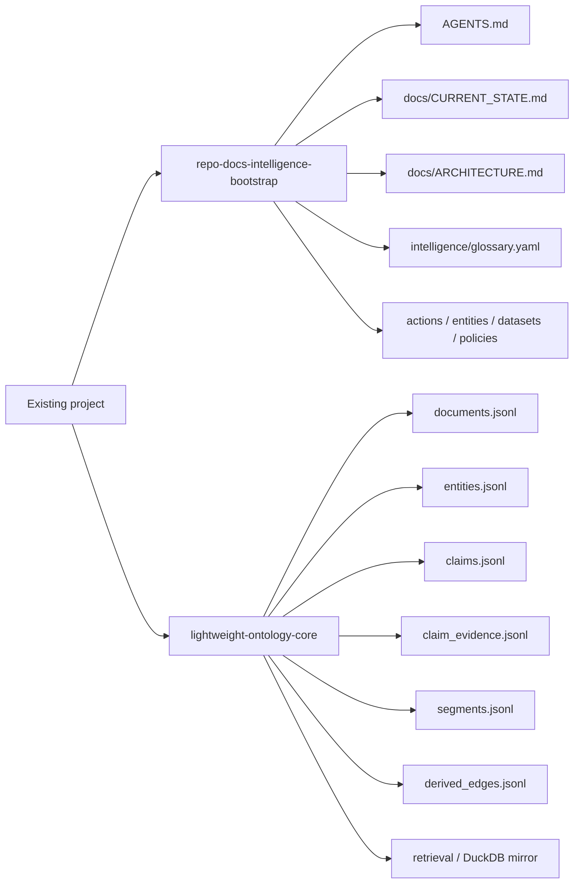

The simple reading is:

- `bootstrap` creates operational baselines and current-state docs
- `ontology` turns document content into a structured fact layer
- they may seem adjacent, but in practice they divide into `operational alignment` and `knowledge structuring`

### How the structure actually runs

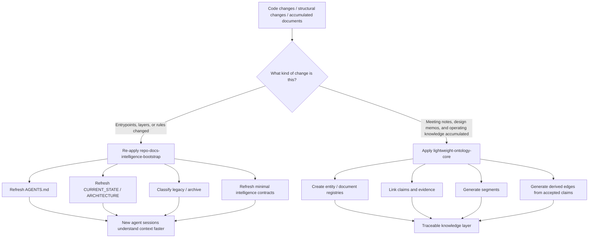

The key idea is not "always run both." The key idea is to re-apply the right skill based on the kind of change the project has gone through.

### The intent of bootstrap

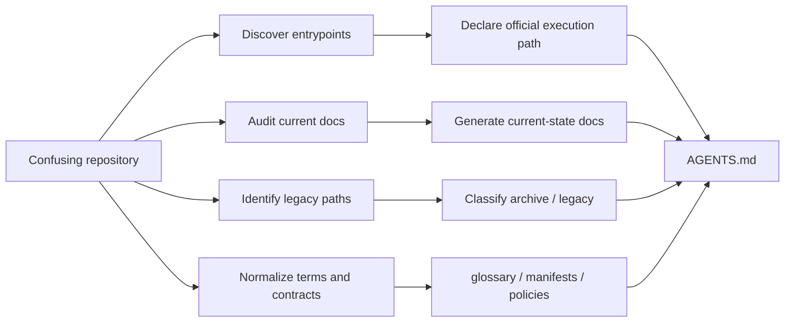

The point of this skill is not to produce lots of documents.

- shorten the path to a usable starting point for the next agent
- make "what is official" explicit inside the repository
- classify older docs meaningfully instead of deleting them blindly
- reduce drift between code and docs in a structural way

### The intent of lightweight ontology

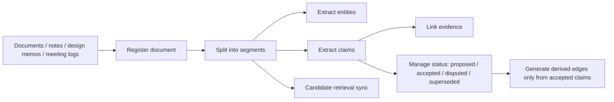

The point of this skill is not "cleaner documents." More precisely, it is:

- turning text from human-readable description into machine-usable fact structure
- making it possible to trace where a claim came from through evidence
- separating accepted, disputed, and superseded states explicitly
- allowing retrieval layers without confusing retrieval results with canonical truth

### Internal layers of lightweight ontology

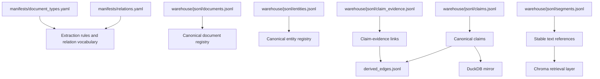

The important distinction is:

- `JSONL registries` are canonical
- `derived_edges` is derived output from accepted claims
- `DuckDB` is an analytical mirror
- `Chroma` is a retrieval support layer

That separation is what keeps a search result from silently becoming an approved fact.

### Why agents become more "naturally competent"

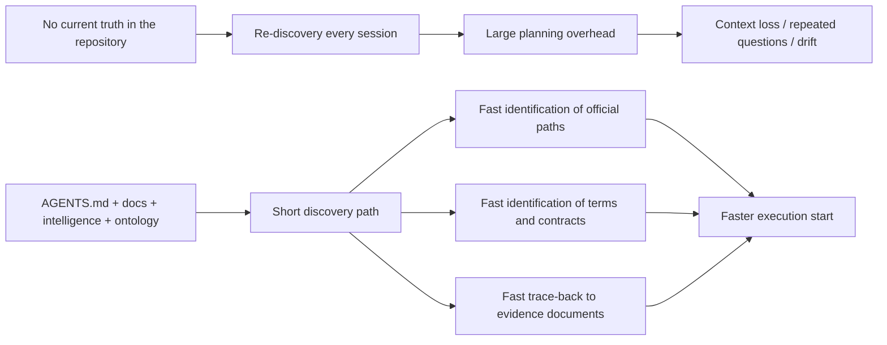

The important point here is that the basis for better behavior is not "model intuition." It is repository-local, structured truth.

### Bootstrap only vs bootstrap plus ontology

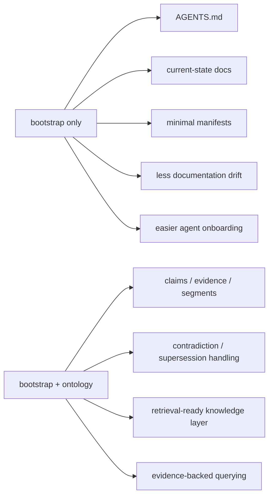

In practice, the decision rule is usually:

- if you mainly need `cleanup and a baseline`, use `bootstrap`
- if you mainly need `fact and evidence tracking`, use `ontology`
- if you need both, start with `bootstrap` and then add `ontology`

## The most practical way to apply this to an existing repository

The most stable sequence is usually the following.

### 1. Apply bootstrap first

From the root of an existing repository, you can ask Codex for something like:

```text
Apply repo-docs-intelligence-bootstrap to this repository.
Use the live codebase to organize AGENTS.md, docs, and a minimal intelligence layer.
Do not delete existing docs; classify them into current vs archive.
```

At this stage, you should expect work such as:

- discovering real entrypoints
- distinguishing official CLIs from unofficial wrappers
- marking docs that no longer match the code
- refreshing the docs that should stay current
- classifying older docs into `docs/archive/`
- writing repository rules into root `AGENTS.md`
- creating a minimal contract layer under `intelligence/`

### 2. Keep building features normally

After that, you continue with normal feature work, experiments, and refactors.

The important point is that these skills do not replace development workflows. They make structural cleanup and current-truth alignment much easier once the project has changed.

### 3. Re-apply bootstrap when structure changes

Bootstrap is worth re-running when things like these happen:

- the main entrypoint changes
- module responsibilities move
- a wrapper becomes the official CLI, or the reverse
- the folder structure grows significantly
- operating rules change
- docs and code begin to drift apart

In practice, you usually do not run it after every feature. You run it when the project structure starts to move.

### 4. Add ontology when document knowledge needs tracking

The value of `lightweight-ontology-core` rises when:

- meeting notes, design docs, and review notes accumulate
- facts and opinions need to be separated
- decision rationale needs to be traceable later
- contradictory or superseded document states need to be managed
- RAG or a broader knowledge layer is planned

At that point, you can ask Codex for something like:

```text
Apply lightweight-ontology-core to this repository's docs and operational documents.
Organize them into entities, claims, evidence, and segments.
Only derive edges from accepted claims, and do not treat retrieval as source of truth.
```

## Real operating examples

### Example A. A small Python tools repository

Assume the project looks roughly like this:

- `app/`
- `scripts/`
- `README.md`
- three outdated usage documents
- the official entrypoint is now `python -m app.cli`, but older docs still explain `scripts/run_local.py`

If you apply bootstrap here, Codex will usually move the repository toward:

- documenting the official entrypoint and work rules in `AGENTS.md`
- documenting the current execution path in `docs/CURRENT_STATE.md`
- adding layer descriptions in `docs/ARCHITECTURE.md`
- classifying `scripts/run_local.py` as a wrapper or legacy path
- moving older docs to `docs/archive/` or adding archived status banners
- recording current major actions in `intelligence/manifests/actions.yaml`

The practical effect is that a future agent session can identify the official execution path without needing a long planning pass.

### Example B. An AI repository with many experiments

Assume the project has:

- `experiments/`
- `pipelines/`
- `notebooks/`
- `docs/`
- inconsistent names for the same ideas across the team

If you apply bootstrap first, you at least get a working glossary and current-state docs. That alone reduces term confusion for later agent sessions.

If you later add ontology, you can do things like:

- extract entities from experiment documents
- distinguish accepted claims from proposed claims
- connect a pipeline to the documents that support it
- track superseded experiment conclusions
- generate retrieval-ready segments

In short, bootstrap makes the repository easier to read, while ontology makes document facts computationally usable.

## What gets automated

These skills are not a background daemon that keeps syncing forever. But they do reduce a lot of repetitive manual work in a Codex-driven repository workflow.

Main automation points include:

- discovering repository entrypoints
- comparing current docs to the actual codebase
- classifying current vs legacy vs archive
- drafting or refreshing `AGENTS.md`
- generating a minimal `docs/` portal
- generating a minimal `intelligence/` contract layer
- creating ontology registries and segment structures
- validating claim/evidence integrity
- generating derived edges from accepted claims

Human judgment is still required, but the repeated work of finding the right files, creating the initial skeleton, and cleaning up drift is reduced significantly.

## How this reduces drift

Drift is usually the state where "the code says A, but the docs still say B." These skills reduce drift through a few strong rules:

- regenerate current-state documentation from code
- separate official entrypoints from legacy paths
- update the smallest canonical artifacts first
- archive older docs instead of silently deleting them
- maintain small truth artifacts such as glossary, manifests, policies, and schemas
- in ontology mode, only derive downstream facts from accepted claims

With that structure in place, an agent does not need to invent a large plan every time. The repository already contains a short path to current truth.

## Why this lowers planning-mode dependence

This does not mean planning becomes unnecessary. It means the amount of planning required for everyday work gets smaller when the repository already contains well-maintained truth markers.

That especially helps when:

- a new session enters the repo for the first time
- there are many docs, but only some are current
- the files an agent should read first are already obvious
- terminology, entrypoints, and layer boundaries have already been clarified

For example, if `AGENTS.md`, `docs/CURRENT_STATE.md`, `docs/ARCHITECTURE.md`, and `intelligence/glossary.yaml` are alive and current, an agent can quickly determine:

- where to start
- what is official
- what is legacy
- which terms are canonical
- which docs should be updated with a code change

So the real goal of this repository is not "eliminate planning mode." The goal is "shrink the surface area that actually needs heavy planning, so day-to-day work can flow more naturally."

## What kinds of projects benefit most

- Python repositories with ongoing experiments and refactors
- AI or ML repositories where operational knowledge keeps spreading across docs
- tool repositories with CLIs, wrappers, and batch scripts living together
- projects where team members change often or agent sessions restart frequently
- repositories likely to grow into RAG, GraphRAG, or provenance-aware retrieval

## When to add ontology

You do not need ontology from day one. It becomes worth adding when signals like these appear:

- "We no longer know which document is current."
- "What was the evidence for that decision again?"
- meeting notes and design docs have accumulated
- documents are starting to contradict each other
- you want to view only accepted facts
- you want retrieval or RAG, but do not want search results confused with canonical truth

If those signals are not present yet, bootstrap alone is often enough to create meaningful value.

## Recommended operating rhythm

### Minimal operating mode

- apply `repo-docs-intelligence-bootstrap` once near project setup
- re-apply bootstrap after major structural changes
- review current-state docs and `AGENTS.md` before releases

### Expanded operating mode

- do everything in the minimal operating mode
- add `lightweight-ontology-core` once document knowledge starts accumulating
- validate claims, evidence, and segments periodically
- sync retrieval state when it is actually useful

## Repository contents

- [repo-docs-intelligence-bootstrap](C:/python_Github/playground/repo-docs-ontology-skills/repo-docs-intelligence-bootstrap)
- [lightweight-ontology-core](C:/python_Github/playground/repo-docs-ontology-skills/lightweight-ontology-core)
- [lg-ontology](C:/python_Github/playground/repo-docs-ontology-skills/lg-ontology)

## Source

The contents were synchronized from a local Codex skills workspace on 2026-03-27.
