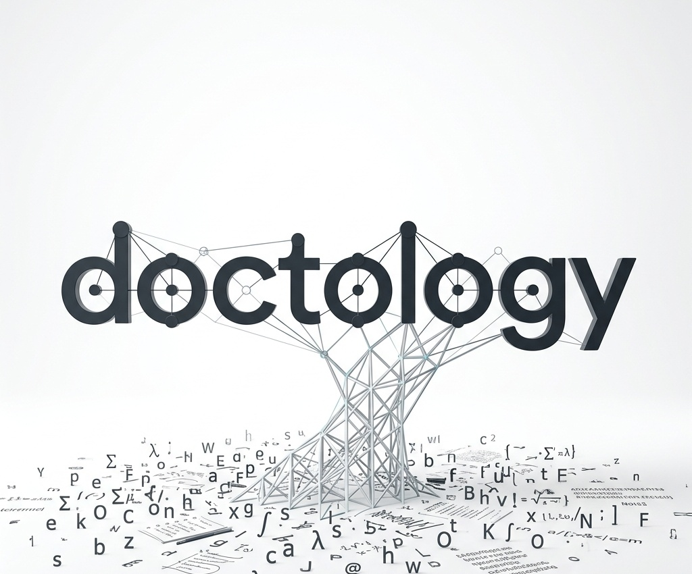
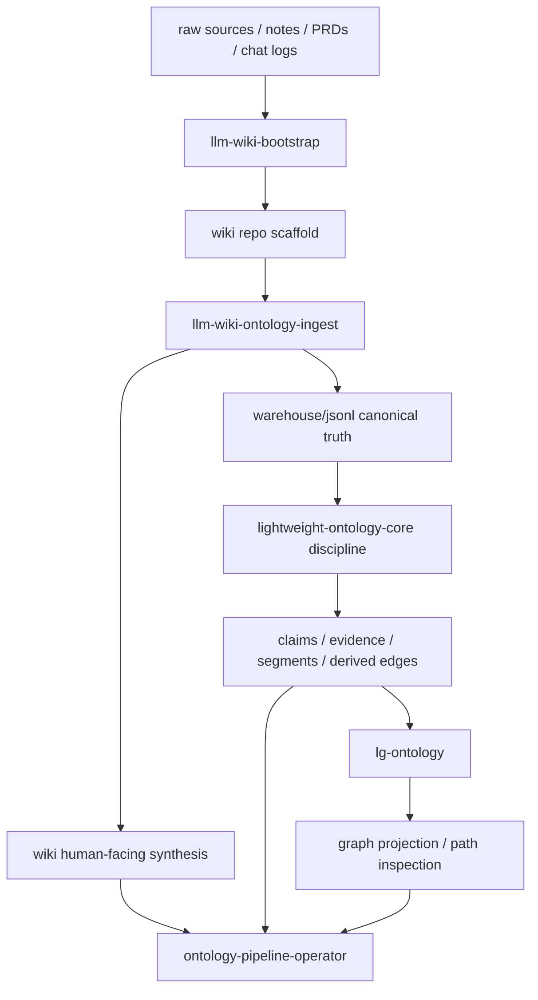

<p align="center">
  
</p>

# DocTology

Obsidian-first LLM Wiki skill pack for building a human-readable wiki surface first, then layering canonical ontology, graph projection, and operator workflows only when they become useful.

한국어로 짧게 말하면,
DocTology는 사람이 계속 읽고 고칠 수 있는 wiki를 먼저 세우고,
그 아래에 canonical JSONL truth layer와 선택적 graph/operator 레이어를 점진적으로 붙이는 실무형 skill pack입니다.

DocTology는 처음부터 거대한 graph platform을 강요하지 않습니다.
대신 사람이 읽는 wiki를 앞면에 두고, 그 아래에 기계가 다룰 수 있는 truth layer를 점진적으로 쌓게 해줍니다.

기본 흐름은 이렇습니다.

`LLM Wiki scaffold -> ontology-backed ingest -> optional graph projection -> optional operator workflow`

## At a glance

- Start with `llm-wiki-bootstrap` when you want a fresh Obsidian-first LLM Wiki repository.
- Use the `wiki-plus-ontology` profile when you want `raw/`, `wiki/`, `AGENTS.md`, `warehouse/jsonl/`, and a compact `intelligence/` layer from day one.
- Use `llm-wiki-ontology-ingest` when new raw sources should update both canonical JSONL registries and the human-facing wiki.
- Use route manifests plus query receipts when you want durable explanations of why a query went to wiki, canonical truth, graph expansion, or operator repair flow.
- Add `lightweight-ontology-core` and `lg-ontology` only when you actually need stronger provenance or multi-hop graph-style inspection.
- Keep the wiki as the front surface; treat ontology and graph layers as support structure, not the product face.

## 한국어

### 이 레포를 한 문장으로 말하면

DocTology는 `문서/노트/회의록/PRD/리서치 메모`를
단순한 파일 모음이 아니라,
`사람은 wiki로 읽고 에이전트는 ontology로 추적할 수 있는 지식 시스템`으로 바꾸기 위한 스킬 모음입니다.

### 왜 LLM Wiki를 중심에 두는가

이 레포의 핵심은 단순히 온톨로지를 만드는 것이 아닙니다.
핵심은 사람이 실제로 계속 읽고, 고치고, 축적할 수 있는 front surface를 만드는 것입니다.

그래서 설명축을 `repo-docs -> ontology`가 아니라 아래처럼 보는 편이 더 맞습니다.

- 앞면: `wiki/` 중심의 인간 친화적 지식 인터페이스
- 뒷면: `warehouse/jsonl/` 중심의 canonical machine-truth
- 확장: graph projection, operator maintenance

즉:
- 사람은 wiki를 읽는다
- 에이전트는 ontology를 검증한다
- graph는 필요할 때만 붙인다
- operator는 반복 운영이 필요할 때만 붙인다

### 어떤 문제를 해결하나

지식성 프로젝트는 보통 이런 식으로 망가집니다.

- 회의록, 설계 메모, 리서치 노트가 쌓이는데 나중에 다시 찾기 어렵다
- 예전 문서와 최신 문서가 섞여서 무엇이 현재 truth인지 모호하다
- 새 세션의 에이전트가 매번 처음부터 맥락을 다시 추론해야 한다
- 검색은 되는데 근거와 claim 상태를 추적하기 어렵다
- wiki만 쓰면 machine-truth가 약하고, ontology만 쓰면 사람이 읽기 불편하다

DocTology는 이 문제를
`wiki를 버리고 ontology로 가자`가 아니라,
`wiki를 중심 인터페이스로 두고 ontology를 뒤에 붙이자`로 풉니다.

## 가장 먼저 보아야 할 사용 경로

### 1. 새 지식 저장소를 만들고 싶다
이 경우의 시작점은:
`llm-wiki-bootstrap`

이 스킬은 다음을 만듭니다.
- `raw/`
- `wiki/`
- `AGENTS.md`
- starter scripts
- meta pages
- optional `warehouse/jsonl/`
- optional minimal `intelligence/`

`wiki-plus-ontology` 프로파일을 고르면 특히 아래가 같이 생깁니다.
- `warehouse/jsonl/*.jsonl` starter registries
- `intelligence/glossary.yaml`
- `intelligence/manifests/datasets.yaml`
- `intelligence/manifests/actions.yaml`
- `intelligence/manifests/relations.yaml`
- `intelligence/manifests/routes.yaml`
- `intelligence/manifests/source_families.yaml`
- `intelligence/policies/query-routing.yaml`
- `intelligence/policies/truth-boundaries.yaml`
- `scripts/ontology_refresh.py`
- `scripts/query_route.py`

즉, “새 Obsidian-first LLM Wiki를 여는 버튼”이면서,
필요하면 ontology-ready scaffold까지 한 번에 여는 시작점입니다.

예시 프롬프트:

```text
Use llm-wiki-bootstrap to scaffold a new Obsidian-first wiki repo.
Use the wiki-plus-ontology profile so the project starts with raw, wiki, AGENTS.md, warehouse/jsonl, and minimal intelligence manifests.
```

### 2. 이미 wiki repo가 있고, source를 계속 넣고 싶다
이 경우의 핵심 스킬은:
`llm-wiki-ontology-ingest`

이 스킬은 다음 흐름을 메인 버튼처럼 다룹니다.

`raw source -> canonical ontology -> wiki synthesis -> meta refresh`

그리고 ingest 시 아래 compact contract layer를 함께 참고하는 방향으로 설계됩니다.
- `intelligence/glossary.yaml`
- `intelligence/manifests/datasets.yaml`
- `intelligence/manifests/actions.yaml`
- `intelligence/manifests/relations.yaml`
- `intelligence/manifests/routes.yaml`
- `intelligence/manifests/source_families.yaml`
- `intelligence/policies/query-routing.yaml`
- `intelligence/policies/truth-boundaries.yaml`

즉 새 source가 들어오면:
- `warehouse/jsonl/`을 갱신하고
- 관련 `wiki/` 페이지를 갱신하고
- `wiki/_meta/index.md`, `wiki/_meta/log.md`도 갱신하고
- 필요하면 `scripts/query_route.py`로 route receipt를 남기고
- `scripts/ontology_refresh.py`로 최소 ontology maintenance 루프를 다시 맞추는
반복 ingest용 스킬입니다.

예시 프롬프트:

```text
Use llm-wiki-ontology-ingest to process the new sources in raw/inbox.
Refresh warehouse/jsonl, affected wiki pages, and wiki/_meta/index.md plus wiki/_meta/log.md.
```

### 3. wiki 아래쪽 canonical truth를 강화하고 싶다
이 경우는:
`lightweight-ontology-core`

이 스킬은 아래를 잘합니다.
- entities 추출
- claims 추출
- evidence 연결
- segments 생성
- contradiction / supersession 관리
- accepted claim 기반 derived edges 생성

즉 wiki만으로는 약한 provenance와 canonical truth를 보강하는 하부 레이어입니다.

예시 프롬프트:

```text
Apply lightweight-ontology-core to this repository's docs and notes.
Extract entities, claims, evidence, and segments.
Only derive downstream edges from accepted claims.
Treat retrieval as a helper layer, not canonical truth.
```

### 4. 그래프형 탐색이 필요하다
이 경우는:
`lg-ontology`

이 스킬은 ontology를 graph DB로 갈아엎는 것이 아니라,
canonical JSONL을 유지한 채 그 위에 graph projection을 얹습니다.

잘 맞는 상황:
- multi-hop path inspection
- neighborhood exploration
- graph-style comparison
- baseline vs graph 비교 실험

예시 프롬프트:

```text
Apply lg-ontology on top of the existing lightweight ontology.
Keep JSONL registries canonical, but add graph projection artifacts and baseline-vs-graph comparison checks.
```

### 5. 이미 구조는 있고 반복 운영이 필요하다
이 경우는:
`ontology-pipeline-operator`

이 스킬은 이미 만들어진 DocTology 계열 구조를 운영하는 쪽입니다.

잘 맞는 상황:
- ontology refresh
- report rebuild
- graph regression check
- docs sync
- single-entry maintenance path 구축

예시 프롬프트:

```text
Use ontology-pipeline-operator to refresh this repository.
Rebuild canonical outputs, validate graph regression risks, and sync current-state docs and wiki maintenance paths.
```

### 6. 기존 일반 repo를 먼저 정리하고 싶다
이 경우는:
`repo-docs-intelligence-bootstrap`

하지만 이 레포에서 이 스킬은 “본체”라기보다,
wiki 이전이나 wiki 외부의 일반 repository/PRD/current-state 정리용 bootstrap에 가깝습니다.

즉 설명의 중심축은 아니고,
아래 같은 경우에 매우 유용한 보조 시작점입니다.
- wiki repo가 아니라 일반 코드 레포부터 정리해야 할 때
- current docs와 actual codebase를 맞춰야 할 때
- `AGENTS.md`, `docs/`, `intelligence/` baseline이 먼저 필요할 때

예시 프롬프트:

```text
Apply repo-docs-intelligence-bootstrap to this repository.
Use the live codebase to refresh AGENTS.md, current-state docs, and a minimal intelligence layer.
Do not delete old docs blindly; classify them into current vs archive.
```

## 추천 시작 경로

### Path A. LLM Wiki 중심 시작
가장 이 레포다운 경로입니다.

`llm-wiki-bootstrap -> llm-wiki-ontology-ingest -> lightweight-ontology-core tuning (optional) -> lg-ontology (optional) -> ontology-pipeline-operator (optional)`

추천 대상:
- 연구노트
- 회의록
- 리서치 메모
- 지식성 프로젝트
- Obsidian 중심 개인/팀 지식 저장소

### Path B. 이미 있는 wiki repo 강화

`llm-wiki-ontology-ingest -> lightweight-ontology-core -> lg-ontology (optional) -> ontology-pipeline-operator (optional)`

추천 대상:
- 이미 `raw/`, `wiki/`, `AGENTS.md`가 있는 저장소
- wiki는 있는데 canonical truth가 약한 저장소

### Path C. 일반 repo에서 출발 후 wiki로 확장

`repo-docs-intelligence-bootstrap -> lightweight-ontology-core -> llm-wiki-bootstrap or equivalent wiki layer -> llm-wiki-ontology-ingest`

추천 대상:
- 먼저 코드 레포를 정리해야 하는 경우
- wiki보다 current-state docs 정리가 먼저 필요한 경우

## 이 레포에 들어있는 스킬 요약

| Skill | 역할 | 언제 쓰면 좋은가 |
|---|---|---|
| `llm-wiki-bootstrap` | 새 Obsidian-first wiki repo 스캐폴드 | 새 지식 저장소를 시작할 때 |
| `llm-wiki-ontology-ingest` | raw source를 ontology + wiki 양쪽으로 반영 | 기존 wiki에 반복 ingest가 필요할 때 |
| `lightweight-ontology-core` | canonical fact/provenance layer | claim/evidence 기반 structured truth가 필요할 때 |
| `lg-ontology` | graph projection 및 graph-style inspection | multi-hop/neighbor/path 탐색이 필요할 때 |
| `ontology-pipeline-operator` | 반복 refresh와 운영 자동화 | 이미 구조가 있고 유지·회귀검사가 중요할 때 |
| `repo-docs-intelligence-bootstrap` | 일반 repo/PRD의 current-state bootstrap | wiki 이전 단계 정리가 필요할 때 |

## 구조를 한눈에 보면



핵심 해석은 이렇습니다.

- `wiki/`는 사람이 읽는 전면 인터페이스입니다
- `warehouse/jsonl/`은 기계가 검증하는 canonical truth입니다
- `lg-ontology`는 선택적 graph layer입니다
- `ontology-pipeline-operator`는 반복 운영용입니다
- `repo-docs-intelligence-bootstrap`는 이 흐름 바깥의 일반 repo 정리 출발점으로 이해하는 편이 맞습니다

## 이 레포가 다른 점

DocTology는 레이어 경계를 강하게 나눕니다.

- raw source는 raw source다
- wiki synthesis는 human-facing surface다
- ontology JSONL은 canonical machine-truth다
- retrieval은 보조층이지 truth가 아니다
- graph projection은 derived layer이지 canonical layer가 아니다

이 구분 덕분에 프로젝트가 커져도 덜 헷갈립니다.

## 누구에게 특히 잘 맞는가

- Obsidian을 중심에 둔 개인 지식 저장소
- 에이전트가 자주 들어와야 하는 연구 저장소
- 회의록 / 메모 / 대화 로그가 계속 쌓이는 팀
- provenance-aware retrieval까지 염두에 두는 프로젝트
- wiki는 사람용, ontology는 기계용으로 분리하고 싶은 사용자

## 빠른 결정 가이드

이럴 때는 이렇게 고르면 됩니다.

- 새 wiki repo를 만들고 싶다 -> `llm-wiki-bootstrap`
- 이미 있는 wiki에 source를 계속 ingest하고 싶다 -> `llm-wiki-ontology-ingest`
- claim/evidence 기반 truth layer가 필요하다 -> `lightweight-ontology-core`
- graph-style 탐색이 필요하다 -> `lg-ontology`
- 반복 refresh와 운영 루틴이 필요하다 -> `ontology-pipeline-operator`
- 먼저 일반 repo를 정리해야 한다 -> `repo-docs-intelligence-bootstrap`

---

## English

### In one sentence

DocTology is a practical skill pack for building an Obsidian-first LLM Wiki as the human-facing surface, then layering canonical ontology, optional graph projection, and optional operator workflows underneath it.

### Core idea

This repository is easiest to understand when the center of gravity is the wiki, not repo-docs.

Think of it this way:
- front surface: human-facing `wiki/`
- truth substrate: canonical `warehouse/jsonl/`
- optional expansion: graph projection and operator maintenance

So the default mental model is:
- humans read the wiki
- agents validate against ontology
- graph is optional
- operator workflows are optional

### Main skill paths

| Skill | Role | Best starting point for |
|---|---|---|
| `llm-wiki-bootstrap` | scaffold a new Obsidian-first wiki repo | starting a new knowledge repository |
| `llm-wiki-ontology-ingest` | update ontology + wiki together from raw sources | repeated ingest in an existing wiki repo |
| `lightweight-ontology-core` | canonical fact and provenance layer | claims, evidence, segments, and structured truth |
| `lg-ontology` | graph projection and graph-style inspection | multi-hop, neighborhood, and path exploration |
| `ontology-pipeline-operator` | maintenance and refresh workflow | ongoing operation of an already-structured stack |
| `repo-docs-intelligence-bootstrap` | repo/PRD current-state bootstrap | non-wiki repos that need cleanup first |

### Recommended default path

`llm-wiki-bootstrap -> llm-wiki-ontology-ingest -> lightweight-ontology-core tuning (optional) -> lg-ontology (optional) -> ontology-pipeline-operator (optional)`

For a stronger ontology-ready start, prefer the `wiki-plus-ontology` profile. It includes starter JSONL registries, compact intelligence manifests (`glossary`, `datasets`, `actions`, `routes`, `relations`, `source_families`, `query-routing`, `truth-boundaries`), `scripts/query_route.py` for route receipts, and `scripts/ontology_refresh.py` for a minimal maintenance loop.

### Example prompts

Create a new wiki repo:

```text
Use llm-wiki-bootstrap to scaffold a new Obsidian-first wiki repo.
Use the wiki-plus-ontology profile so the project starts with raw, wiki, AGENTS.md, warehouse/jsonl, and minimal intelligence manifests.
```

Run repeated ingest in an existing wiki repo:

```text
Use llm-wiki-ontology-ingest to process the new sources in raw/inbox.
Refresh warehouse/jsonl, affected wiki pages, and wiki/_meta/index.md plus wiki/_meta/log.md.
```

Strengthen the canonical truth layer:

```text
Apply lightweight-ontology-core to this repository's docs and notes.
Extract entities, claims, evidence, and segments.
Only derive downstream edges from accepted claims.
Treat retrieval as a helper layer, not canonical truth.
```

Add graph-style exploration:

```text
Apply lg-ontology on top of the existing lightweight ontology.
Keep JSONL registries canonical, but add graph projection artifacts and baseline-vs-graph comparison checks.
```

Operate an existing stack:

```text
Use ontology-pipeline-operator to refresh this repository.
Rebuild canonical outputs, validate graph regression risks, and sync current-state docs and wiki maintenance paths.
```

### Repository contents

- [llm-wiki-bootstrap](./llm-wiki-bootstrap)
- [llm-wiki-ontology-ingest](./llm-wiki-ontology-ingest)
- [lightweight-ontology-core](./lightweight-ontology-core)
- [lg-ontology](./lg-ontology)
- [ontology-pipeline-operator](./ontology-pipeline-operator)
- [repo-docs-intelligence-bootstrap](./repo-docs-intelligence-bootstrap)
