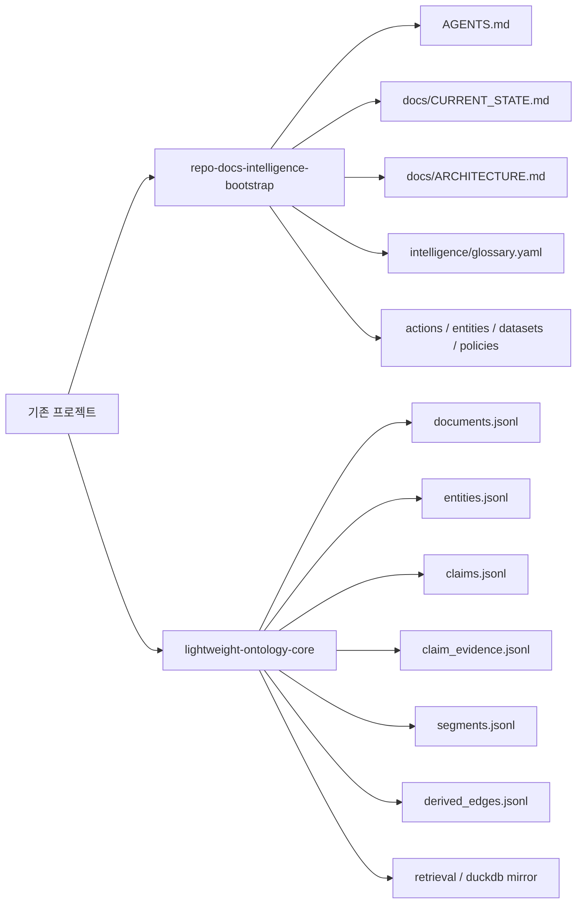
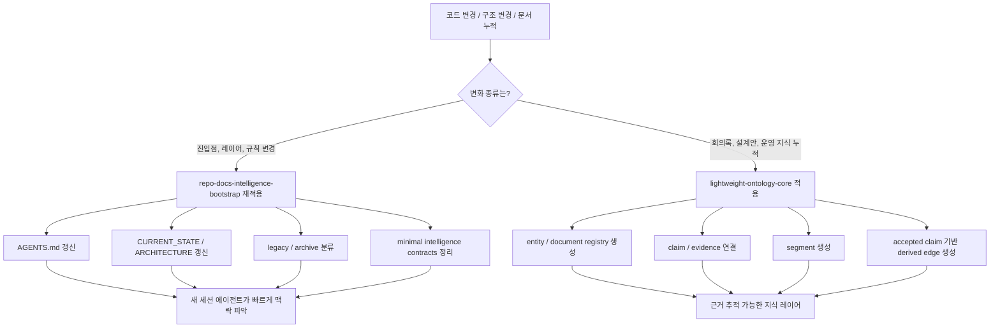
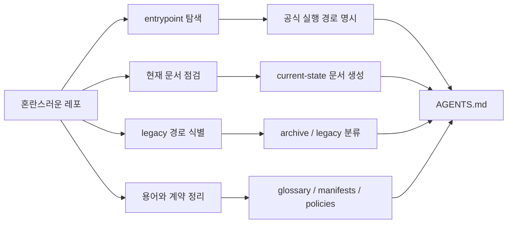
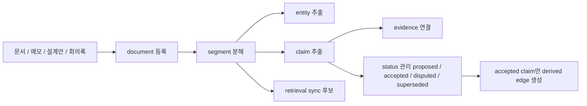
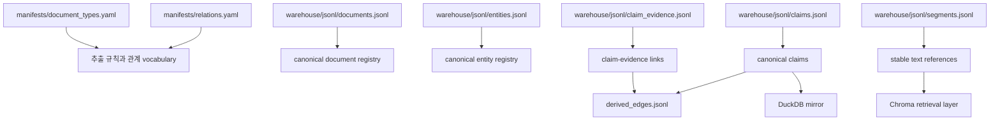
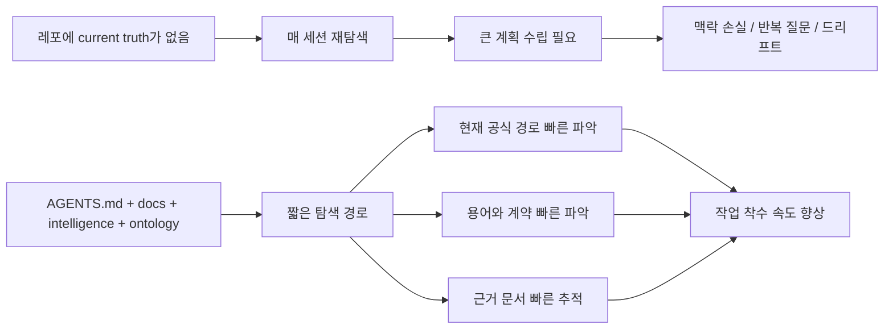
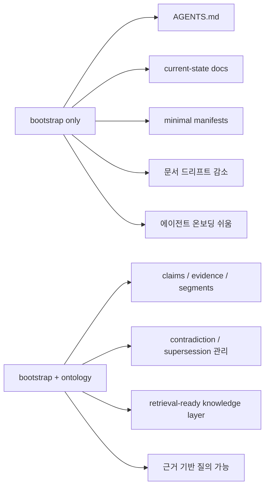
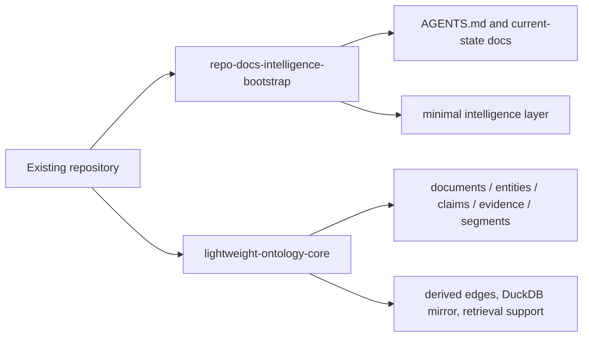

# Repo Docs + Ontology Skills

## 한국어

이 저장소는 Codex에서 함께 쓰기 좋은 두 개의 스킬을 묶어둔 패키지입니다.

- `repo-docs-intelligence-bootstrap`
- `lightweight-ontology-core`

둘은 비슷해 보이지만 역할이 다릅니다.

- `repo-docs-intelligence-bootstrap`
  기존 프로젝트를 현재 코드 기준으로 다시 정렬합니다. `AGENTS.md`, `docs/`, `intelligence/`의 최소 기준선을 만들고, 문서 드리프트를 줄이는 쪽에 강합니다.
- `lightweight-ontology-core`
  문서, 메모, 설계안, 운영 노트를 `entities`, `relations`, `claims`, `evidence`, `segments` 같은 구조화된 지식으로 바꿉니다. 사실과 근거를 추적해야 할 때 유용합니다.

실무에서는 대부분 `bootstrap`부터 쓰고, 필요해지면 `ontology`를 추가합니다.

## 이 레포가 해결하려는 문제

기존 프로젝트는 보통 이런 상태로 커집니다.

- 실제 코드는 바뀌었는데 `README`와 운영 문서는 예전 상태를 설명함
- 스크립트, CLI, 래퍼, 실험 폴더가 섞여서 공식 진입점이 모호함
- 사람마다 다른 설명을 하고, 새 세션의 에이전트도 매번 다시 맥락을 추론해야 함
- 기능은 되지만 문서와 규칙이 코드 뒤를 따라오지 못해 드리프트가 생김

이 두 스킬은 이 문제를 "문서를 예쁘게 쓰는 것"이 아니라 "현재 truth를 명시적으로 남기는 것"으로 다룹니다.

## 핵심 개념

### 1. Bootstrap은 저장소의 기준선을 만든다

`repo-docs-intelligence-bootstrap`는 보통 아래 결과물을 지향합니다.

- 루트 `AGENTS.md`
- `docs/README.md`
- `docs/CURRENT_STATE.md`
- `docs/ARCHITECTURE.md`
- `docs/LAYERS.md`
- `docs/SKILLS_INTEGRATION.md`
- `docs/ROADMAP.md`
- `docs/IMPACT_SUMMARY.md`
- `docs/archive/`
- `intelligence/glossary.yaml`
- `intelligence/manifests/actions.yaml`
- `intelligence/manifests/entities.yaml`
- `intelligence/manifests/datasets.yaml`
- `intelligence/handlers/*.yaml`
- `intelligence/policies/*.yaml`
- `intelligence/schemas/*.sql`
- `intelligence/registry/capabilities.yaml`

이 구조의 목적은 "이 프로젝트는 지금 무엇이 공식이고, 무엇이 레거시이며, 어디가 source of truth인지"를 빠르게 보이게 만드는 것입니다.

### 2. Ontology는 문서를 지식 레이어로 바꾼다

`lightweight-ontology-core`는 아래처럼 더 구조화된 운영이 필요할 때 들어갑니다.

- 문서에서 엔터티를 뽑고 싶을 때
- 결정 사항을 claim과 evidence로 연결하고 싶을 때
- 예전 문서와 새 문서가 충돌하는지 추적하고 싶을 때
- 문서 내용을 segment 단위로 나눠 retrieval이나 provenance에 쓰고 싶을 때
- "무엇이 accepted 사실인가"를 데이터로 관리하고 싶을 때

주요 산출물은 보통 아래와 같습니다.

- `intelligence/manifests/relations.yaml`
- `intelligence/manifests/document_types.yaml`
- `warehouse/jsonl/entities.jsonl`
- `warehouse/jsonl/documents.jsonl`
- `warehouse/jsonl/claims.jsonl`
- `warehouse/jsonl/claim_evidence.jsonl`
- `warehouse/jsonl/segments.jsonl`
- `warehouse/jsonl/derived_edges.jsonl`
- `warehouse/ontology.duckdb`
- `vector/chroma/`

## 시각화

### 두 스킬의 역할 분담



읽는 법은 단순합니다.

- `bootstrap`는 레포의 운영 기준선과 현재 상태 문서를 만듭니다.
- `ontology`는 문서 내용을 구조화된 사실 레이어로 바꿉니다.
- 둘이 겹치는 것처럼 보여도, 실제로는 `운영 정렬`과 `지식 구조화`로 책임이 나뉩니다.

### 실제로 굴러가는 구조



핵심은 `항상 둘 다 돌리는 구조`가 아니라, 변화의 성격에 따라 필요한 스킬을 다시 적용하는 구조입니다.

### bootstrap의 의도



이 스킬의 의도는 문서를 많이 만드는 것이 아닙니다.

- 에이전트가 헤매지 않게 시작점을 짧게 만들기
- "무엇이 공식인가"를 레포 안에 명시적으로 남기기
- 오래된 문서를 삭제하지 않고 의미 있게 분류하기
- 코드와 문서가 어긋나는 드리프트를 구조적으로 줄이기

### 경량 온톨로지의 의도



이 스킬의 의도는 "문서를 더 예쁘게 정리"가 아닙니다. 더 정확히는 아래입니다.

- 텍스트를 `사람이 읽는 설명`에서 `기계도 다룰 수 있는 사실 구조`로 바꾸기
- claim이 어디서 왔는지 evidence로 추적 가능하게 만들기
- accepted / disputed / superseded 상태를 분리해서 운영하기
- retrieval을 붙여도 canonical truth와 헷갈리지 않게 분리하기

### 경량 온톨로지 내부 레이어



이 구조에서 중요한 구분은 아래입니다.

- `JSONL registry`는 canonical
- `derived_edges`는 accepted claim 기반의 derived output
- `DuckDB`는 분석용 mirror
- `Chroma`는 retrieval 보조층

즉 `검색 결과`가 곧 `승인된 사실`이 되지 않도록 경계를 분명히 둡니다.

### 에이전트가 왜 더 "알잘딱" 움직이게 되는가



여기서 중요한 포인트는 자동 판단의 근거가 "모델 감"이 아니라 "레포 안에 저장된 구조화된 truth"라는 점입니다.

### bootstrap만 쓸 때와 ontology까지 쓸 때의 차이



실무 판단 기준은 보통 이렇습니다.

- 현재 필요한 것이 `정리와 기준선`이면 `bootstrap`
- 현재 필요한 것이 `사실/근거 추적`이면 `ontology`
- 둘 다 필요하면 `bootstrap` 후 `ontology`

## 기존 프로젝트에 적용하는 가장 실무적인 순서

아래 순서가 가장 안정적입니다.

### 1. 먼저 bootstrap만 적용한다

기존 프로젝트 루트에서 Codex에게 아래처럼 요청합니다.

```text
이 레포에 repo-docs-intelligence-bootstrap를 적용해서
현재 코드 기준으로 AGENTS.md, docs, intelligence 최소 구조를 정리해줘.
기존 문서는 삭제하지 말고 current / archive 기준으로 분류해줘.
```

이 단계에서 기대하는 일은 다음과 같습니다.

- 실제 엔트리포인트 탐색
- 공식 CLI와 비공식 래퍼 구분
- 현재 코드와 안 맞는 문서 표시
- 필요한 문서는 갱신
- 오래된 문서는 `docs/archive/`로 분류
- 루트 `AGENTS.md`에 작업 규칙 정리
- 최소 `intelligence/` 계약층 생성

### 2. 기능 개발은 평소처럼 진행한다

이후에는 평소처럼 기능 개발, 실험, 리팩터링을 진행하면 됩니다.

중요한 점은 이 스킬들이 개발 흐름을 대체하지 않는다는 것입니다. 대신 "프로젝트가 변한 뒤 구조적 정리와 current truth 정렬"을 훨씬 쉽게 해줍니다.

### 3. 구조가 바뀌면 bootstrap를 다시 적용한다

아래 변화가 생기면 bootstrap를 다시 돌리면 좋습니다.

- 진입점이 바뀜
- 모듈 책임이 이동함
- wrapper가 공식 CLI를 대체했거나 반대로 격하됨
- 폴더 구조가 커졌음
- 운영 규칙이 바뀜
- 문서와 코드가 어긋나기 시작함

실무적으로는 "기능 하나 끝날 때마다"가 아니라 "구조가 흔들릴 때마다" 적용하는 것이 적절합니다.

### 4. 문서 지식의 추적이 필요해지면 ontology를 추가한다

아래 상황부터는 `lightweight-ontology-core` 가치가 커집니다.

- 회의록, 설계안, 리뷰 노트가 많이 쌓임
- 사실과 의견을 구분해야 함
- 결정 근거를 나중에 다시 추적해야 함
- 문서 간 모순과 superseded 관계를 관리하고 싶음
- RAG나 knowledge layer를 붙일 계획이 있음

이때 Codex에게 아래처럼 요청할 수 있습니다.

```text
이 레포의 docs와 운영 문서를 lightweight-ontology-core 기준으로
entities, claims, evidence, segments 구조로 정리해줘.
accepted claim만 파생 관계로 반영하고
retrieval 계층은 source of truth로 취급하지 않게 해줘.
```

## 실제 운영 예시

### 예시 A. 작은 Python 도구 프로젝트

프로젝트가 이런 상태라고 가정합니다.

- `app/`
- `scripts/`
- `README.md`
- 오래된 사용법 문서 3개
- 현재는 `python -m app.cli`가 공식 진입점인데, 예전 문서는 `scripts/run_local.py`를 설명함

이때 bootstrap를 적용하면 Codex는 보통 아래 방향으로 정리합니다.

- `AGENTS.md`에 공식 진입점과 작업 원칙 기록
- `docs/CURRENT_STATE.md`에 현재 실행 경로 기록
- `docs/ARCHITECTURE.md`에 레이어 설명 추가
- `scripts/run_local.py`는 wrapper인지 legacy인지 분류
- 옛 문서는 `docs/archive/`로 이동하거나 archived status banner 추가
- `intelligence/manifests/actions.yaml`에 현재 주요 액션 정리

결과적으로 다음 세션의 에이전트는 플랜 모드 없이도 "무엇이 공식 실행 경로인지"를 문서에서 바로 잡을 수 있습니다.

### 예시 B. 실험이 많은 AI 프로젝트

프로젝트가 이런 상태라고 가정합니다.

- `experiments/`
- `pipelines/`
- `notebooks/`
- `docs/`
- 사람마다 다른 이름으로 같은 개념을 부름

bootstrap를 먼저 적용하면 최소 glossary와 current-state 문서가 생깁니다. 이 상태만으로도 에이전트가 용어 혼동을 덜 하게 됩니다.

이후 ontology를 추가하면 다음이 가능해집니다.

- 실험 문서에서 entity 추출
- accepted / proposed claim 구분
- 특정 파이프라인이 어떤 문서 근거를 가지는지 연결
- superseded 실험 결론 추적
- retrieval용 segment 생성

즉 bootstrap는 "레포를 읽기 쉽게" 만들고, ontology는 "문서 사실을 계산 가능하게" 만듭니다.

## 무엇이 자동화되는가

이 스킬들은 백그라운드 데몬처럼 자동 동기화되는 시스템은 아닙니다. 하지만 Codex 작업 루프에서 반복되던 수작업을 많이 줄여줍니다.

주요 자동화 포인트는 아래와 같습니다.

- 레포 엔트리포인트 탐색
- 현재 문서와 실제 코드 비교
- current / legacy / archive 분류
- `AGENTS.md` 초안 또는 갱신
- 최소 `docs/` 포털 문서 생성
- 최소 `intelligence/` 계약층 생성
- ontology용 registry와 segment 구조 생성
- claim/evidence 무결성 검증
- accepted claim 기반 파생 관계 생성

즉 "사람이 해야 하는 판단"은 남아 있지만, "어디를 봐야 하는지 찾기", "기본 골격 만들기", "드리프트가 생긴 지점 정리하기" 같은 작업을 크게 줄여줍니다.

## 드리프트를 어떻게 줄여주는가

드리프트는 보통 "실제 코드는 A인데 문서는 B를 말하는 상태"입니다. 이 스킬들은 드리프트를 줄이기 위해 다음 원칙을 씁니다.

- 코드 기준으로 현재 상태를 다시 문서화함
- 공식 엔트리포인트와 레거시 경로를 분리함
- 작은 canonical artifact를 먼저 갱신함
- 오래된 문서를 삭제보다 archive로 분류함
- glossary, manifests, policies, schemas 같은 작은 기준 파일을 둠
- ontology에서는 accepted claim만 파생 데이터로 반영함

이 구조가 있으면 에이전트는 거대한 플랜을 매번 새로 짜지 않아도 됩니다. 이미 레포 안에 "현재 truth를 찾는 짧은 경로"가 생기기 때문입니다.

## 왜 플랜 모드 의존도를 낮춰주는가

플랜 모드가 불필요해진다는 뜻은 아닙니다. 다만 아래 상황에서 별도 계획 수립 부담을 크게 줄여줍니다.

- 새 세션이 레포에 처음 들어왔을 때
- 문서가 많지만 현재 기준이 따로 있을 때
- 에이전트가 먼저 읽어야 할 파일이 명확할 때
- 용어, 엔트리포인트, 레이어 경계가 이미 정리돼 있을 때

예를 들어 `AGENTS.md`, `docs/CURRENT_STATE.md`, `docs/ARCHITECTURE.md`, `intelligence/glossary.yaml`이 살아있으면 에이전트는 다음을 빠르게 판단할 수 있습니다.

- 어디서 시작해야 하는가
- 무엇이 공식 경로인가
- 무엇이 legacy인가
- 어떤 용어를 써야 하는가
- 어떤 변경이 어느 문서를 함께 갱신해야 하는가

즉 이 레포의 목적은 "플랜 모드를 없애는 것"이 아니라 "플랜이 필요한 범위를 줄이고, 평소 작업은 더 자연스럽게 굴러가게 만드는 것"입니다.

## 어떤 프로젝트에 특히 잘 맞는가

- 실험과 리팩터링이 반복되는 Python 프로젝트
- 문서가 누적되며 운영 지식이 흩어지는 AI/ML 프로젝트
- CLI, wrapper, batch script가 함께 존재하는 도구형 레포
- 팀원이 바뀌거나 에이전트 세션이 자주 새로 시작되는 프로젝트
- RAG, GraphRAG, provenance-aware retrieval로 확장 가능성이 있는 프로젝트

## 언제 ontology까지 도입하면 좋은가

처음부터 꼭 필요하지는 않습니다. 아래 신호가 보일 때 도입하면 좋습니다.

- "어떤 문서가 최신인지 모르겠다"
- "이 결정의 근거가 뭐였지?"를 자주 묻는다
- 회의록과 설계안이 많아졌다
- 문서끼리 충돌한다
- accepted 사실만 따로 보고 싶다
- RAG나 검색 계층에 넣고 싶은데 canonical truth와 분리하고 싶다

이 신호가 없다면 bootstrap만으로도 충분히 큰 효과를 봅니다.

## 권장 운영 루틴

### 최소 운영

- 프로젝트 초기에 `repo-docs-intelligence-bootstrap` 1회 적용
- 큰 구조 변경 뒤 bootstrap 재적용
- 릴리스 전 current-state 문서와 `AGENTS.md` 점검

### 확장 운영

- 위 최소 운영 수행
- 문서 지식이 누적되면 `lightweight-ontology-core` 도입
- 주기적으로 claims, evidence, segments 검증
- 필요할 때 retrieval 동기화

## 저장소 구성

- [repo-docs-intelligence-bootstrap](C:/python_Github/playground/repo-docs-ontology-skills/repo-docs-intelligence-bootstrap)
- [lightweight-ontology-core](C:/python_Github/playground/repo-docs-ontology-skills/lightweight-ontology-core)

## English

This repository packages two complementary Codex skills:

- `repo-docs-intelligence-bootstrap`
- `lightweight-ontology-core`

## What they do

- `repo-docs-intelligence-bootstrap`
  Aligns repository docs, `AGENTS.md`, and a minimal intelligence layer with the live codebase. It is the right first step for an existing project with drifted docs or unclear entrypoints.
- `lightweight-ontology-core`
  Adds a structured knowledge layer over documents using entities, relations, claims, evidence, and segments. It is useful when you need provenance, contradiction tracking, or retrieval-ready document structure.

## Visual overview



Bootstrap aligns repository truth around code and operations.
Ontology turns document knowledge into structured, traceable facts.

## Practical adoption flow

1. Run `repo-docs-intelligence-bootstrap` first on an existing repository.
2. Keep building features normally.
3. Re-run bootstrap when structure, entrypoints, or repository rules change.
4. Add `lightweight-ontology-core` once project knowledge needs explicit claims, evidence, and segment-level provenance.

## What gets easier

These skills do not act as a background daemon. Instead, they reduce repeated setup and interpretation work for Codex sessions by making current repository truth explicit.

They help with:

- discovering real entrypoints
- separating official paths from legacy wrappers
- generating or refreshing `AGENTS.md`
- maintaining current-state docs
- creating lightweight manifest and policy artifacts
- reducing documentation drift
- structuring knowledge for provenance-aware retrieval

## Why this reduces planning overhead

The goal is not to eliminate planning entirely. The goal is to keep enough repository truth close to the code that a new agent session can quickly understand:

- where to start
- what is official
- what is legacy
- which terms are canonical
- which docs should be updated with a code change

That makes many day-to-day tasks more direct, even without a heavy planning step.

## Recommended use

Use bootstrap by default for most existing repositories.

Add ontology when:

- document volume grows
- decision tracking matters
- evidence-backed claims become important
- contradiction or supersession needs to be tracked
- retrieval or RAG layers are being introduced

## Source

The contents were synchronized from a local Codex skills workspace on 2026-03-19.
